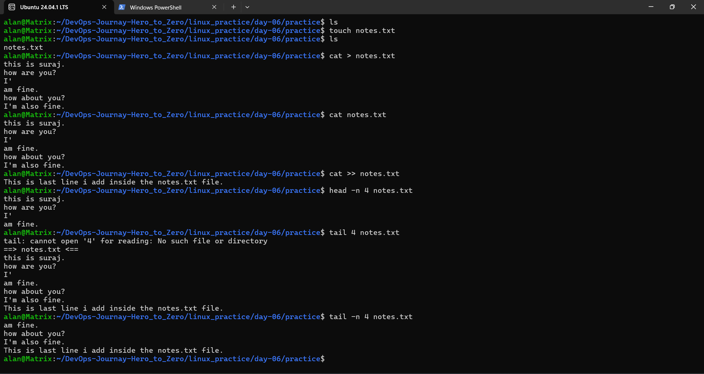
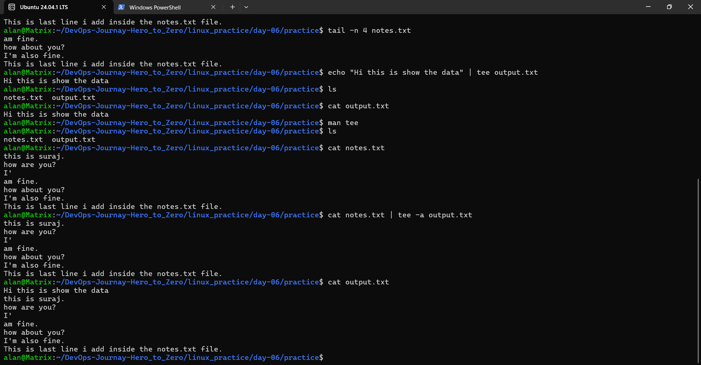

# Day 06 - Linux File I/O Practice

# Objective

The goal of this practice was to understand basic Linux file input/output (I/O) operations. During this exercise, I learned how to create files, write data, append new content, display file contents, view specific sections of a file, and use the tee command for simultaneous output and file writing.

---

# 1. Create a File

## What?

Creating an empty file that can store text or other data.

## Why?

In Linux, configuration files, logs, and scripts are stored as files. Creating files is one of the most basic tasks for a DevOps engineer.

## How?

I created a new file named notes.txt.

### Command

```bash
touch notes.txt
```

### Output



---

# 2. Write Data to a File

## What?

Writing text into a file using output redirection (>).

## Why?

The > operator creates a file if it doesn't exist and overwrites existing content.

## How?

I added multiple lines to the file.

### Command

```bash
cat > notes.txt
```

Entered:

```
this is suraj.
how are you?
I'
am fine.
how about you?
I'm also fine.
```

Display the file:

### Screenshot


```

---

# 3. Append Data to a File

## What?

Appending new content to an existing file.

## Why?

Appending preserves existing data while adding new information. This is commonly used for logs.

## How?

I used the append redirection operator (>>).

### Command

```bash
cat >> notes.txt
```

Added:

```
This is last line i add inside the notes.txt file.
```

Verify:

```bash
cat notes.txt
```

### Screenshot


---

# 4. Read the Entire File

## What?

Reading all the contents of a file.

## Why?

To verify data and inspect file contents.

## How?

Using the cat command.

### Command

```bash
cat notes.txt
```

### Screenshot


---

# 5. Read the Beginning of a File

## What?

Display the first few lines of a file.

## Why?

Useful for checking headers, configuration files, and log beginnings.

## How?

Using the head command.

### Command

```bash
head -n 4 notes.txt
```


### Screenshot




---

# 6. Read the End of a File

## What?

Display the last few lines of a file.

## Why?

DevOps engineers frequently check the latest log entries.

## How?

Initially, I tried:

```bash
tail -n 4 notes.txt
```

### Screenshot


---

# 7. Use tee Command

## What?

The tee command displays output on the terminal and writes it to a file simultaneously.

## Why?

It is useful for saving command output while viewing it.

## How?

Create and display output:

```bash
echo "Hi this is show the data" | tee output.txt
```

Verify:

```bash
cat output.txt
```

### Output

### Screenshot


---

# 8. Append Data Using tee

## What?

Append existing file content to another file using tee -a.

## Why?

The -a option appends data instead of overwriting.

## How?

### Command

```bash
cat notes.txt | tee -a output.txt
```


Verify:

```bash
cat output.txt
```

### Screenshot


---

# Commands Used

| Command | Purpose |
|---------|----------|
| touch notes.txt | Create an empty file |
| cat > notes.txt | Write content to a file |
| cat >> notes.txt | Append content to a file |
| cat notes.txt | Display the entire file |
| head -n 4 notes.txt | Display the first 4 lines |
| tail -n 4 notes.txt | Display the last 4 lines |
| echo "..." \| tee output.txt | Display and write output |
| cat notes.txt \| tee -a output.txt | Append file content while displaying |

---

# What I Learned

- Created files using touch.
- Wrote data using redirection (>).
- Appended data using (>>).
- Read complete file contents with cat.
- Viewed the beginning of files using head.
- Viewed the end of files using tail.
- Learned the correct syntax for tail -n.
- Used tee to write and display output simultaneously.
- Used tee -a to append data without overwriting existing content.

---

# Why This Matters for DevOps

File handling is a fundamental DevOps skill because:

- Application logs are stored in text files.
- Configuration files need frequent editing and verification.
- Shell scripts generate and manipulate file output.
- Monitoring and troubleshooting often involve reading log files.
- Automation tools like Bash, Ansible, and CI/CD pipelines rely heavily on file operations.


# Handwritten Practice Notes

I also documented today's Linux File I/O practice in handwritten notes for better understanding and revision.

## PDF Notes

📄 **Handwritten Notes:** [View PDF](DAY-06pdf.pdf)

> The PDF contains my handwritten commands, observations, and practice steps performed during Day 06.
