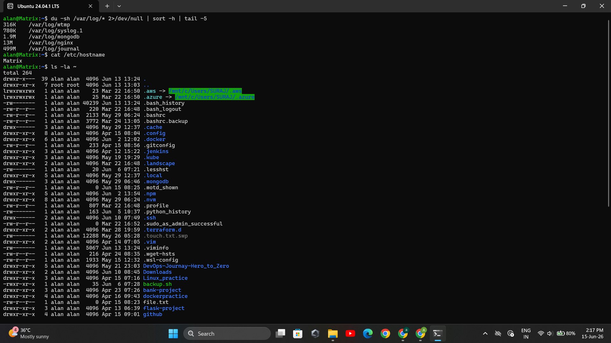
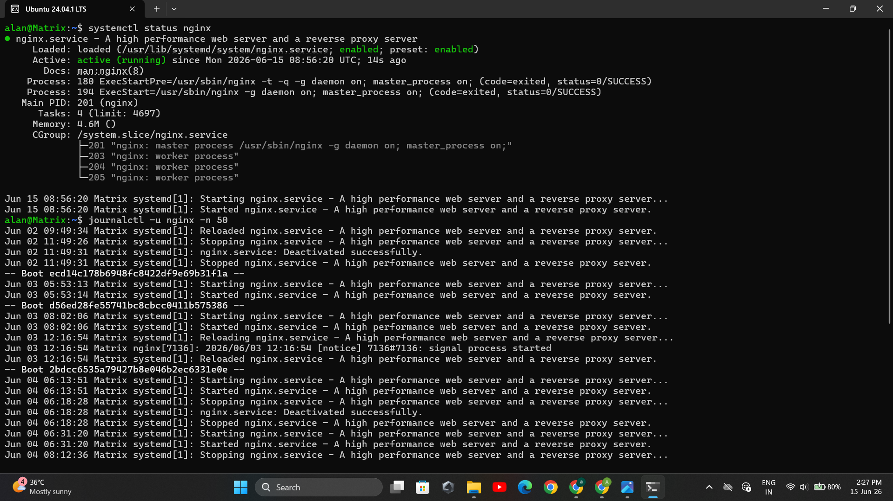
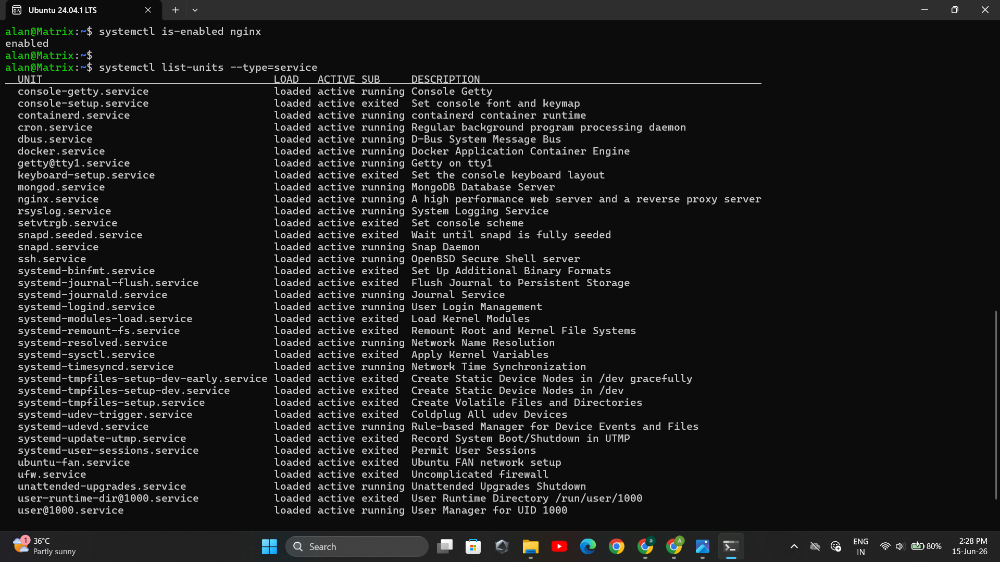
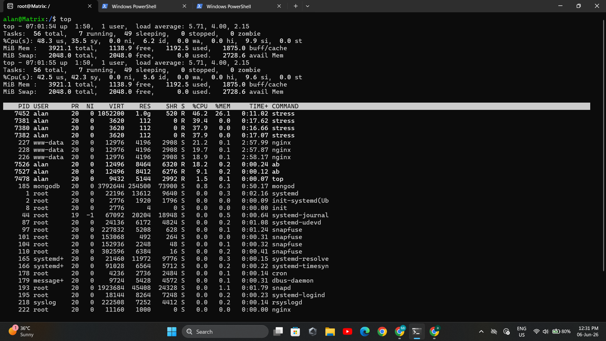
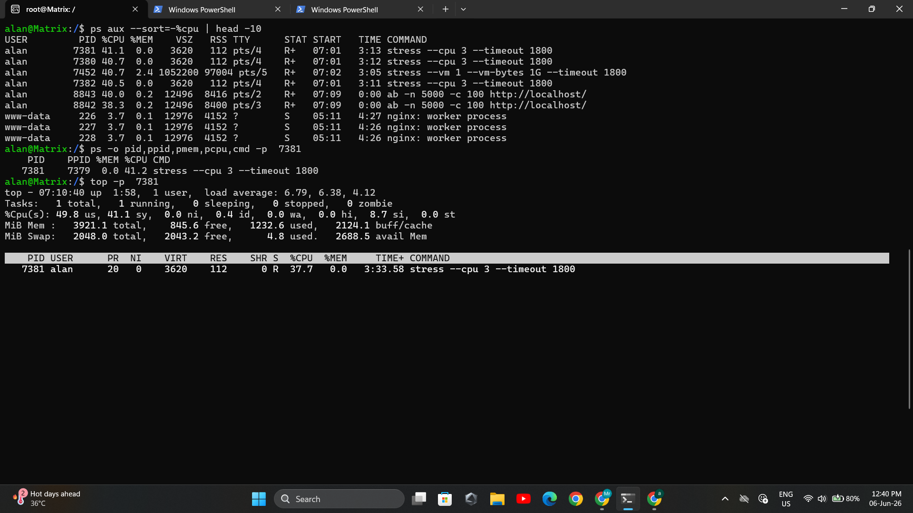
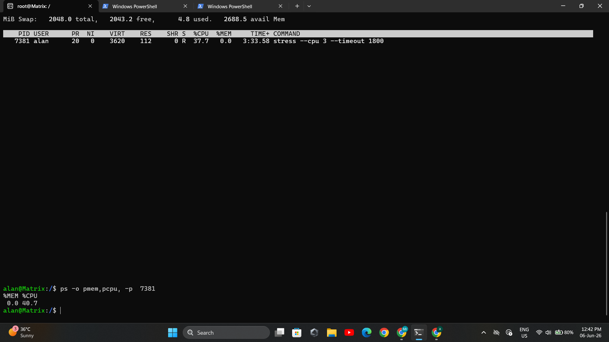
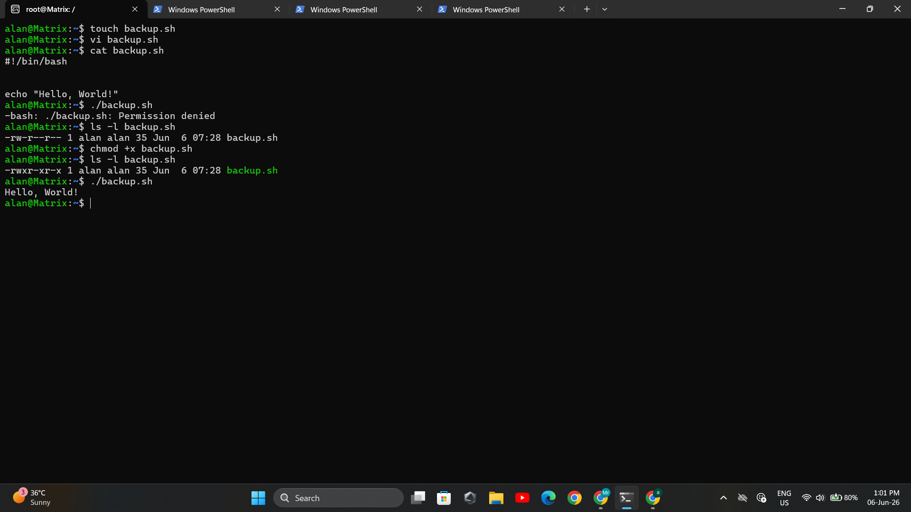

# Day 07 - Linux File System Hierarchy & Scenario-Based Practice

## Objective

Today's goal was to understand the Linux File System Hierarchy and practice troubleshooting scenarios commonly encountered by DevOps engineers.

## Topics Covered

- Linux File System Hierarchy
- Important Linux directories
- Log file investigation
- Configuration files
- Service troubleshooting
- CPU troubleshooting
- Service log analysis
- File permission issues

---

# Part 1: Linux File System Hierarchy

---

## 1. `/` (Root Directory)

### Purpose
The root directory is the top-level directory of Linux. Every file and folder starts from here.

### Example

```bash
ls -l /
```

### Sample Items

- home
- etc

### I would use this when...
Navigating the Linux filesystem or locating important system directories.


---

## 2. `/home`

### Purpose

Stores personal files and directories for normal users.

### Example

```bash
ls -l /home
```

### Sample Items

- user
- suraj

### I would use this when...

Managing user files and personal scripts.


---

## 3. `/root`

### Purpose

Home directory of the root (administrator) user.

### Example

```bash
ls -l /root
```

### Sample Items

- .bashrc
- scripts

### I would use this when...

Performing administrative tasks.


---

## 4. `/etc`

### Purpose

Contains system-wide configuration files.

### Example

```bash
ls -l /etc
```

### Sample Items

- hostname
- hosts

### I would use this when...

Editing system configurations.

---

## 5. `/var/log`

### Purpose

Stores system and application log files.

### Example

```bash
ls -l /var/log
```

### Sample Items

- syslog
- auth.log

### I would use this when...

Troubleshooting system and service issues.

---

## 6. `/tmp`

### Purpose

Stores temporary files created by applications and users.

### Example

```bash
ls -l /tmp
```

### Sample Items

- temp files
- cache files

### I would use this when...

Checking temporary application data.


---

# Additional Directories

---

## `/bin`

### Purpose

Contains essential Linux commands.

Examples:
- ls
- cp

I would use this when...
Running basic Linux commands.

---

## `/usr/bin`

### Purpose

Contains most user-level executable programs.

Examples:
- git
- python3

I would use this when...
Using installed applications.

---

## `/opt`

### Purpose

Stores optional third-party software.

Examples:
- Google Chrome
- Custom applications

I would use this when...
Installing external software packages.

---

# Hands-on Tasks

---

## Find Largest Log Files

### Command

```bash
du -sh /var/log/* 2>/dev/null | sort -h | tail -5
```
---

## Check Hostname

### Command

```bash
cat /etc/hostname
```

---

## Check Home Directory

### Command

```bash
ls -la ~
```
---

### Output Screenshot




---

# Part 2: Scenario-Based Practice

---

# Scenario 1: Service Not Starting

## Step 1

```bash
systemctl status nginx
```

Why:
Check whether the service is active, failed, or stopped.

---

## Step 2

```bash
journalctl -u nginx -n 50
```

Why:
Review recent logs for error messages.

---

## Step 3

```bash
systemctl is-enabled nginx
```

Why:
Verify whether the service starts automatically after reboot.

---

## Step 4

```bash
systemctl list-units --type=service
```

Why:
Confirm the service exists and inspect other running services.

### Output Screenshot






---

# Scenario 2: High CPU Usage

## Step 1

```bash
top
```

Why:
Monitor CPU usage in real time.

---

## Step 2

```bash
htop
```

Why:
Provides an interactive process viewer.

---

## Step 3

```bash
ps aux --sort=-%cpu | head -10
```

Why:
Display top CPU-consuming processes.

---

## Step 4

Record the PID of the process consuming the most CPU.

```bash
ps -p PID
```

Why:
Investigate the problematic process.

### Output Screenshot







---

# Scenario 3: Finding Service Logs

## Step 1

```bash
systemctl status nginx
```

Why:
Check service health.

---

## Step 2

```bash
journalctl -u nginx -n 50
```

Why:
View recent Docker logs.

---

## Step 3

```bash
journalctl -u nginx -f
```

Why:
Monitor logs in real time.


---

# Scenario 4: File Permission Issue

## Step 1

```bash
ls -l /home/user/backup.sh
```

Why:
Check current permissions.

---

## Step 2

```bash
chmod +x /home/user/backup.sh
```

Why:
Grant execute permission.

---

## Step 3

```bash
ls -l /home/user/backup.sh
```

Why:
Verify execute permission was added.

---

## Step 4

```bash
./backup.sh
```




Why:
Run the script to confirm the issue is resolved.

---

# Key Learnings

✅ Linux has a structured filesystem hierarchy.

✅ `/etc` contains configuration files.

✅ `/var/log` is essential for troubleshooting.

✅ `systemctl` and `journalctl` are primary tools for service management.

✅ `top`, `htop`, and `ps` help diagnose CPU issues.

✅ File execution requires execute (`x`) permission.

✅ A systematic troubleshooting approach is more valuable than memorizing commands.

---

# Commands Practiced

```bash
ls
du
sort
tail
cat
systemctl
journalctl
top
htop
ps
chmod
```
---


# Handwritten Practice Notes

## PDF Notes

📄 **Handwritten Notes:** [View PDF](DAY-07_page-0001.pdf)

> The PDF contains my handwritten commands, observations, and practice steps performed during Day 07.

---
📚 Conclusion

Day 07 strengthened my understanding of the Linux File System Hierarchy and practical troubleshooting techniques. I learned how important directories support system operations and how to investigate common issues related to services, logs, processes, and file permissions.
