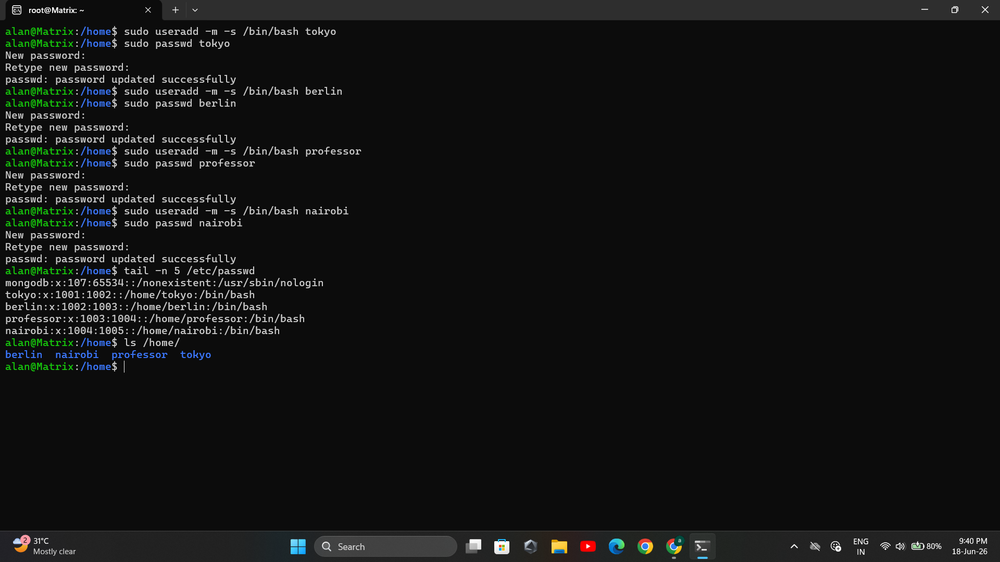
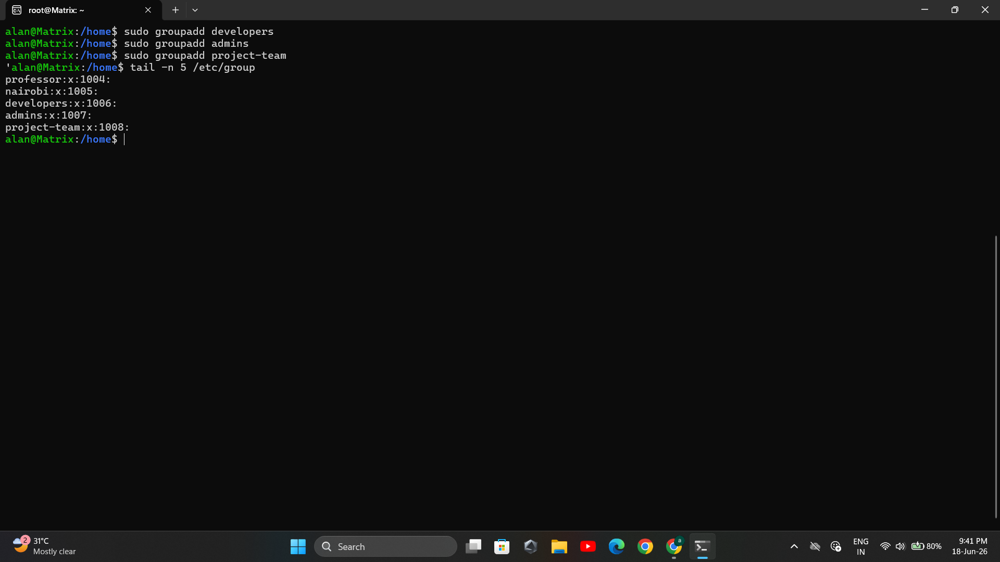
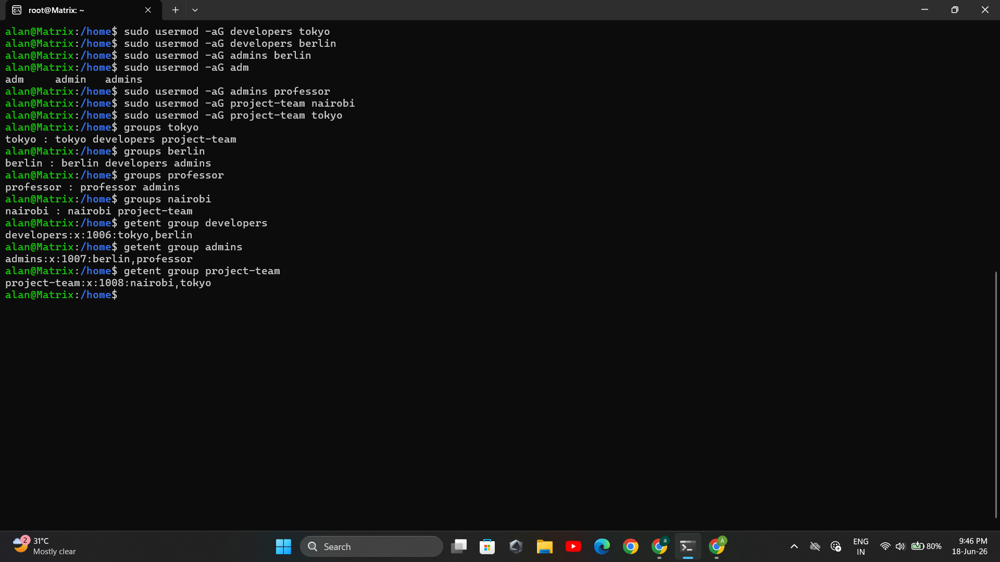
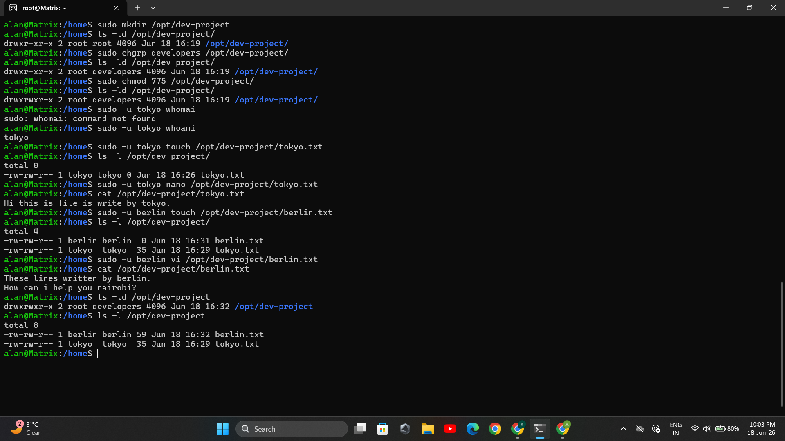
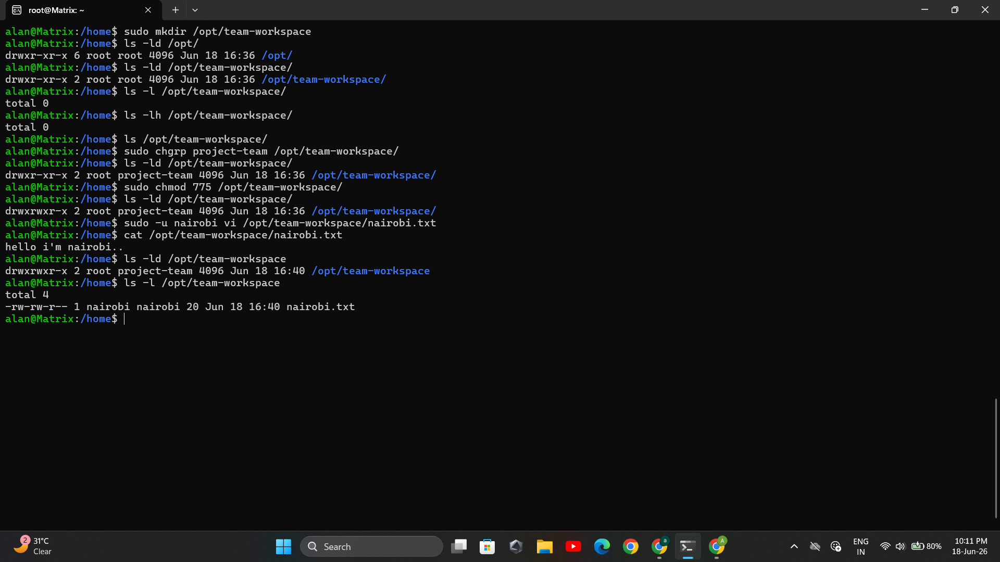

# Day 09: Linux User and Group Management Challenge

## Objective

The objective of this challenge is to understand and practice Linux user and group management. This includes creating users and groups, assigning permissions, managing shared workspaces, and verifying access control using Linux commands.

---

# Why User and Group Management?

Linux uses users and groups to control access to files, directories, and system resources.

### Benefits:

* Improves security.
* Enables collaboration among multiple users.
* Controls access to shared resources.
* Simplifies permission management for teams.

---

# Prerequisites

* Linux system (Ubuntu/CentOS/RHEL)
* Sudo privileges
* Basic knowledge of Linux commands

---

# Task 1: Create Users

## What?

Create four users with home directories:

* tokyo
* berlin
* professor
* nairobi

## Why?

Each user represents an individual account with its own home directory and permissions.

## Commands

```bash
sudo useradd -m tokyo
sudo passwd tokyo

sudo useradd -m berlin
sudo passwd berlin

sudo useradd -m professor
sudo passwd professor

sudo useradd -m nairobi
sudo passwd nairobi
```

## Verification

Check users:

```bash
cat /etc/passwd
```

Check home directories:

```bash
ls /home
```

## Output Screenshot




---

# Task 2: Create Groups

## What?

Create groups:

* developers
* admins
* project-team

## Why?

Groups allow multiple users to share permissions.

## Commands

```bash
sudo groupadd developers
sudo groupadd admins
sudo groupadd project-team
```

## Verification

```bash
cat /etc/group
```

## Output Screenshot



---

# Task 3: Assign Users to Groups

## What?

Assign users as follows:

| User      | Group              |
| --------- | ------------------ |
| tokyo     | developers         |
| berlin    | developers, admins |
| professor | admins             |
| nairobi   | project-team       |
| tokyo     | project-team       |

## Why?

A user can belong to multiple groups and inherit permissions from each.

## Commands

```bash
sudo usermod -aG developers tokyo

sudo usermod -aG developers berlin
sudo usermod -aG admins berlin

sudo usermod -aG admins professor

sudo usermod -aG project-team nairobi
sudo usermod -aG project-team tokyo
```

## Verification

```bash
groups tokyo
groups berlin
groups professor
groups nairobi
```

## Output Screenshot




---

# Task 4: Create Shared Developer Directory

## What?

Create a shared directory for developers.

Directory:

```
/opt/dev-project
```

Group Owner:

```
developers
```

Permissions:

```
775
```

## Why?

Allows developers to collaborate while restricting write access to others.

## Commands

```bash
sudo mkdir /opt/dev-project

sudo chgrp developers /opt/dev-project

sudo chmod 775 /opt/dev-project
```

## Test Access

Create files as tokyo and berlin:

```bash
sudo -u tokyo touch /opt/dev-project/tokyo.txt

sudo -u berlin touch /opt/dev-project/berlin.txt
```

## Verification

```bash
ls -ld /opt/dev-project

ls -l /opt/dev-project
```

## Output Screenshot



---

# Task 5: Create Team Workspace

## What?

Create a shared workspace for the project team.

Directory:

```
/opt/team-workspace
```

Group:

```
project-team
```

Permissions:

```
775
```

## Why?

Provides a collaborative workspace for project members.

## Commands

```bash
sudo mkdir /opt/team-workspace

sudo chgrp project-team /opt/team-workspace

sudo chmod 775 /opt/team-workspace
```

## Test Access

Create a file as nairobi:

```bash
sudo -u nairobi touch /opt/team-workspace/nairobi.txt
```

## Verification

```bash
ls -ld /opt/team-workspace

ls -l /opt/team-workspace
```

## Output Screenshot




---

# Summary

## Users Created

* tokyo
* berlin
* professor
* nairobi

---

## Groups Created

* developers
* admins
* project-team

---

## Group Assignments

| User      | Groups                   |
| --------- | ------------------------ |
| tokyo     | developers, project-team |
| berlin    | developers, admins       |
| professor | admins                   |
| nairobi   | project-team             |

---

## Directories Created

| Directory           | Group        | Permissions |
| ------------------- | ------------ | ----------- |
| /opt/dev-project    | developers   | 775         |
| /opt/team-workspace | project-team | 775         |

---

# Commands Used

```bash
useradd
passwd
groupadd
usermod
groups
mkdir
chgrp
chmod
touch
ls
cat
sudo
```

---

# Verification Commands

```bash
cat /etc/passwd

cat /etc/group

groups username

ls /home

ls -ld /opt/dev-project

ls -ld /opt/team-workspace

ls -l /opt/dev-project

ls -l /opt/team-workspace
```


---

# What I Learned

1. How to create and manage Linux users and groups.
2. How to assign users to multiple groups for collaborative access.
3. How Linux file ownership and permissions (775) enable secure shared workspaces.
4. How to verify user, group, and directory configurations.
5. How to test permissions by executing commands as different users.

---

# Conclusion

This challenge provided practical experience with Linux user and group administration. By creating users, managing groups, configuring shared directories, and testing permissions, I gained hands-on knowledge of Linux access control mechanisms commonly used in system administration and DevOps environments.
