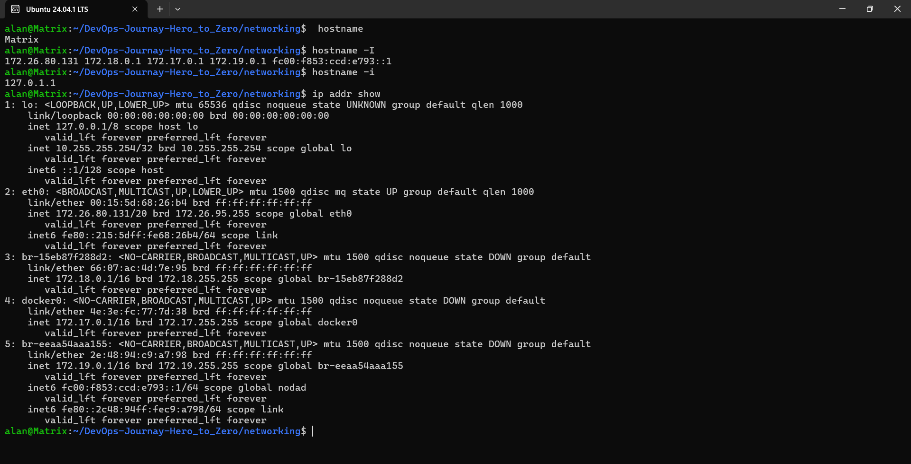
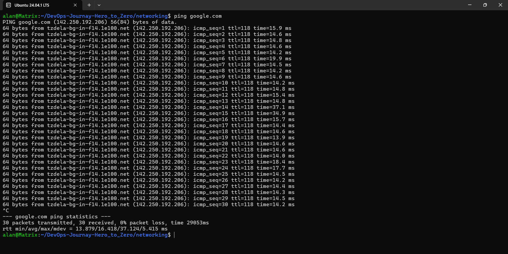
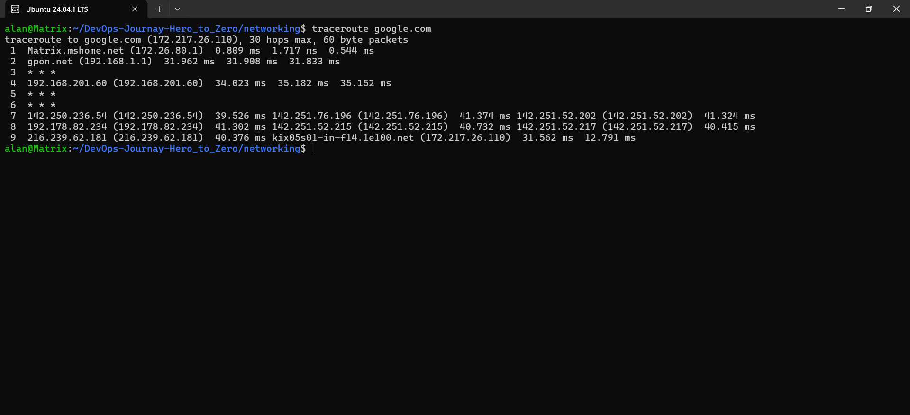
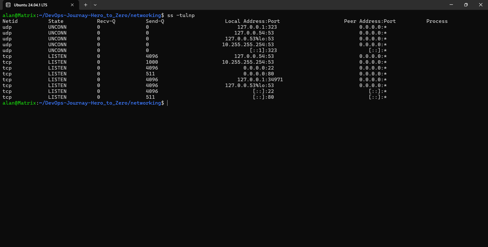
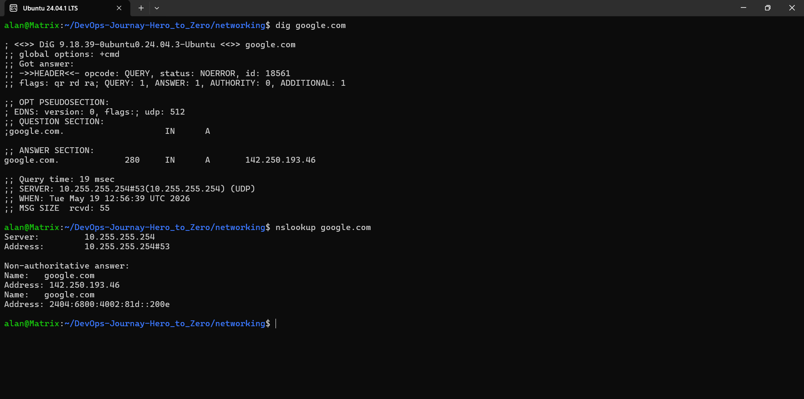
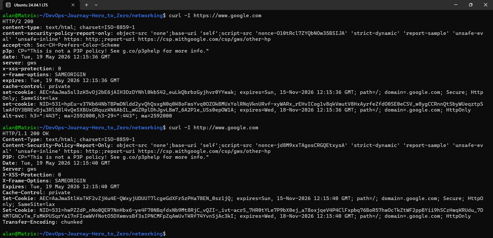
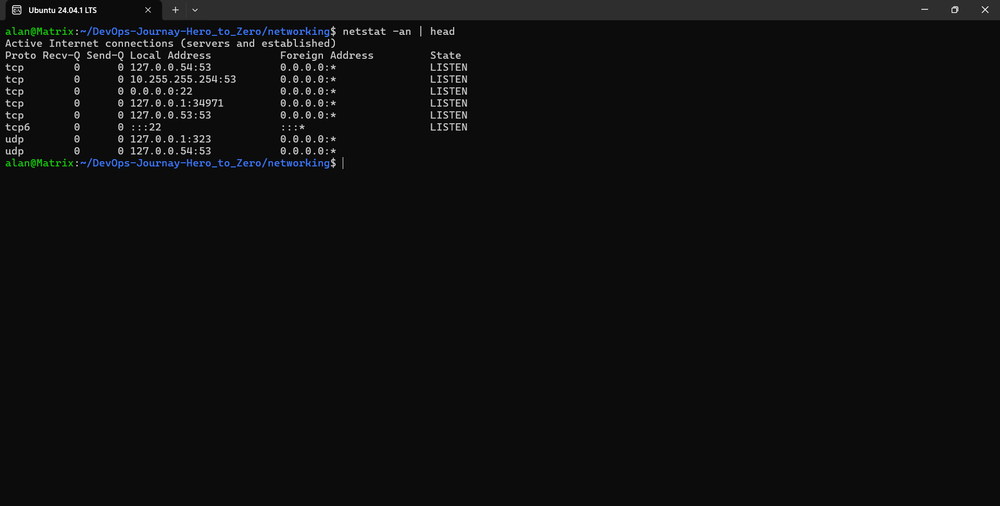
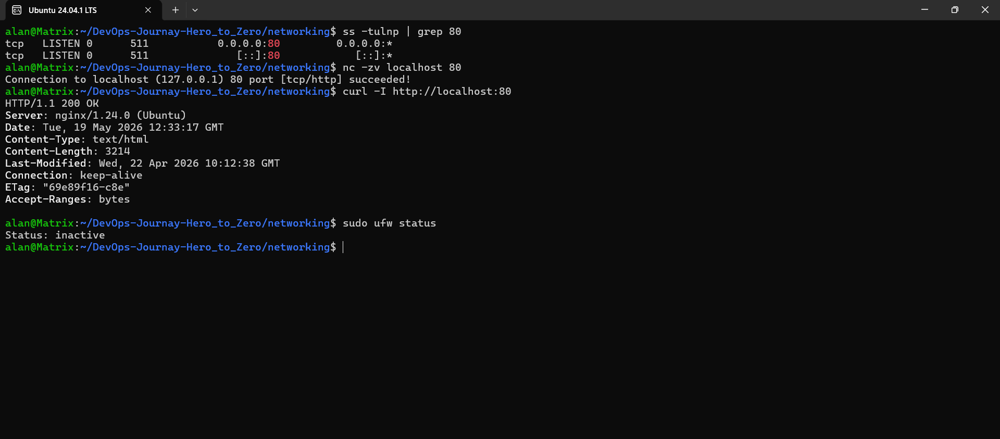

## Day 14 – Networking Basics & Troubleshooting

What is Networking: When computers are connected via the internet and share data. It is called networking or computer networking.

---
## OSI Model
* The OSI (Open Systems Interconnection) model is a framework that explains how computers communicate over a network.
* It divides networking into 7 layers, where each layer has a specific job.
* It helps understand and troubleshoot networking problems step by step.
* It provides a standard way for different devices and technologies to communicate properly.
* But is theory not a practical Model. 

## OSI Model Layers

## 1. Physical Layer (Layer 1)
- Transfers raw data through cables, Wi-Fi, or hardware signals.
- Devices: cables, hubs, repeaters.

## 2. Data Link Layer (Layer 2)
- Transfers data between devices in the same network.
- Uses MAC addresses for communication.

## 3. Network Layer (Layer 3)
- Finds the best path for data transfer between networks.
- Uses IP addresses and routers.

## 4. Transport Layer (Layer 4)
- Ensures reliable and complete data delivery.
- Uses TCP and UDP protocols.

## 5. Session Layer (Layer 5)
- Starts, manages, and ends communication sessions.
- Keeps devices connected during data exchange.

## 6. Presentation Layer (Layer 6)
- Converts, encrypts, and formats data.
- Makes data readable for applications.

## 7. Application Layer (Layer 7)
- Provides network services to users and applications.
- Examples: HTTP, HTTPS, FTP, DNS.

---

## What is TCP/IP?
- TCP/IP stands for Transmission Control Protocol / Internet Protocol.
- It is the real networking model used on the internet for communication between devices.

---

## Why do we use TCP/IP when OSI already exists?
- OSI model is mainly used for learning and understanding networking concepts.
- TCP/IP is the practical model actually used in real-world internet communication.

---

## TCP/IP Layers

## 1. Link Layer
- Handles communication inside the local network using Ethernet or Wi-Fi.
- Responsible for physical data transfer between devices.

### Examples
- Ethernet
- Wi-Fi
- MAC Address

---

## 2. Internet Layer
- Responsible for routing packets between different networks.
- Uses IP addresses to identify source and destination devices.

### Examples
- IP Address
- Router
- ICMP

---

## 3. Transport Layer
- Ensures data is delivered correctly between applications.
- Uses TCP for reliable communication and UDP for faster communication.

### Examples
- TCP
- UDP
- Port Numbers

---

## 4. Application Layer
- Provides services directly to user applications.
- Allows communication for web browsing, email, file transfer, and DNS.

### Examples
- HTTP
- HTTPS
- DNS
- SSH

---

## OSI vs TCP/IP Mapping

| OSI Model | TCP/IP Model |
|---|---|
| Application | Application |
| Presentation | Application |
| Session | Application |
| Transport | Transport |
| Network | Internet |
| Data Link | Link |
| Physical | Link |

---

# Simple TCP/IP Flow

```text
Application Layer → Creates request
Transport Layer → Adds TCP/UDP
Internet Layer → Adds IP address
Link Layer → Sends data through network
```
---

## TCP/IP Stack

| Layer       | Protocol Examples     |
| ----------- | --------------------- |
| Application | HTTP, HTTPS, DNS, SSH |
| Transport   | TCP, UDP              |
| Internet    | IP, ICMP              |
| Link        | Ethernet, Wi-Fi       |

---

## Where Protocols Sit in the Stack

| Protocol   | Layer                    |
| ---------- | ------------------------ |
| IP         | Internet / Network Layer |
| TCP/UDP    | Transport Layer          |
| HTTP/HTTPS | Application Layer        |
| DNS        | Application Layer        |

---

## Real Example

```bash
curl https://example.com
```

### Explanation

* `curl` works at the Application Layer.
* HTTPS uses TCP at the Transport Layer.
* TCP packets travel using IP addresses at the Internet Layer.

Simple flow:

Application (HTTPS)
↓
Transport (TCP)
↓
Internet (IP)
↓
Link (Ethernet/Wi-Fi)

---

## Hands-on Checklist

## 1. Identity Check

## `hostname`
```bash
hostname
```
- Displays the system’s host name (computer name).
- Used to identify the machine on a network.

### Example Output
```text
Matrix
```

---

## `hostname -I`
```bash
hostname -I
```
- Shows all IP addresses assigned to the system.
- Useful for checking network and Docker bridge IPs.

### Example Output
```text
172.26.80.131 172.18.0.1 172.17.0.1
```

---

## `hostname -i`
```bash
hostname -i
```
- Displays the local IP address linked with the hostname.
- Often shows loopback/local address like `127.0.1.1`.

### Example Output
```text
127.0.1.1
```

---

## `ip addr show`
```bash
ip addr show
```
- Displays detailed network interface information.
- Shows IP addresses, network adapters, MAC addresses, and interface status.





| Command | Purpose |
|---|---|
| `hostname` | Show computer name |
| `hostname -I` | Show all IP addresses |
| `hostname -i` | Show local hostname IP |
| `ip addr show` | Show full network details |
---

## 2. Reachability Test

* Checks if the target host is reachable.
* Helps identify latency and packet loss.
# Reachability Test

## Command
```bash
ping google.com
```

## Result Summary
- Target host reachable successfully
- 0% packet loss detected
- Average latency: 16.4 ms
- Network connection is stable

---

# Important Values

| Metric | Value | Meaning |
|---|---|---|
| Packets Sent | 30 | Total packets transmitted |
| Packets Received | 30 | Successful replies received |
| Packet Loss | 0% | No packets lost |
| Minimum Latency | 13.879 ms | Fastest response |
| Average Latency | 16.418 ms | Average response time |
| Maximum Latency | 37.124 ms | Slowest response |
| mdev | 5.415 ms | Latency variation/jitter |

---

# Packet Example

```text
64 bytes from 142.250.192.206: icmp_seq=1 ttl=118 time=15.9 ms
```

### Explanation
- `64 bytes` → size of returned packet
- `icmp_seq=1` → packet number
- `ttl=118` → packet lifetime value
- `time=15.9 ms` → response time (latency)

---

# Final Statistics

```text
30 packets transmitted, 30 received, 0% packet loss
```

- All packets successfully returned
- No connectivity issue detected

---

```text
rtt min/avg/max/mdev = 13.879/16.418/37.124/5.415 ms
```

### Meaning
- `min` → fastest latency
- `avg` → average latency
- `max` → slowest latency
- `mdev` → latency variation between packets
---



---

## 3. Path Check

### Command

```bash
traceroute google.com
```

OR

```bash
tracepath google.com
```

### Example Observation

* Some hops may timeout because routers block ICMP.
* Long response time on a hop may indicate network delay.
  
# Summary

| Observation | Result |
|---|---|
| Destination reachable | Yes |
| Total hops | 9 |
| Packet loss visible | No |
| Timeout hops | 3, 5, 6 |
| Average latency | Around 30–40 ms |



---


## 4. Listening Ports

### Command

```bash
ss -tulpn
```

OR

```bash
netstat -tulpn
```

### Example Output

```bash
LISTEN 0 128 0.0.0.0:22
```

### Observation

* Shows active listening services.
* Example: SSH service listening on port 22.




---

## 5. DNS Resolution

### Command

```bash
dig google.com
```

OR

```bash
nslookup google.com
```

### Example Output

```bash
Address: 142.250.182.14
```

### Observation

* Converts domain names into IP addresses.
* Useful when websites are not opening.




---

## 6. HTTP Header Check

### Command

```bash
curl -I https://google.com
```

### Example Output

```bash
HTTP/2 200
```

### Observation

* Confirms whether the web server is responding.
* HTTP 200 means success.



---

## 7. Connection Snapshot

### Command

```bash
netstat -an | head
```

### Example Observation

* LISTEN means waiting for connections.
* ESTABLISHED means active communication is happening.



---

# Mini Task – Port Probe & Interpretation

## Step 1: Identify Listening Port

### Command

```bash
ss -tulpn
```

### Example

```bash
0.0.0.0:80
```

```bash
 nginx service is listening on port 22.
```

---

## Step 2: Test the Port

### Command

```bash
nc -zv localhost 80
```

### Example Output

```bash
Connection to localhost 80 port [tcp/ssh] succeeded!
```

### Observation

* Port 80 is reachable.
* If unreachable, the next checks would be:

  * Verify service status
  * Check firewall rules
  * Confirm service is listening on the expected port




---

# Reflection

## Which command gives the fastest signal when something is broken?

```bash
ping google.com
```

### Why?

- Instantly checks network connectivity
- Shows DNS resolution + reachability
- Gives latency and packet loss in real time

---

## What layer (OSI/TCP-IP) would you inspect next if DNS fails? If HTTP 500 shows up?

## If DNS Fails

| Layer | Reason |
|---|---|
| OSI Layer 7 / TCP-IP Application Layer | DNS works at the application layer and converts domain names into IP addresses |

### Next Checks
```bash
nslookup google.com
ping 8.8.8.8
cat /etc/resolv.conf
```

- Check DNS resolution
- Verify internet connectivity
- Verify DNS server configuration

---

## If HTTP 500 Error Appears

| Layer | Reason |
|---|---|
| OSI Layer 7 / TCP-IP Application Layer | HTTP 500 means the server/application failed internally |

### Next Checks
```bash
systemctl status nginx
docker logs <container>
kubectl logs <pod>
```

- Check web server status
- Check application/container logs
- Identify backend/server errors


---
## Two Follow-up Checks During Real Incidents

## 1. Check Service Status

```bash
systemctl status nginx
```

Purpose:

* Confirms whether the application service is running.

---

## 2. Check Firewall Rules

```bash
sudo ufw status
```

Purpose:

* Verifies whether traffic is blocked by firewall rules.

---

## Summary

In this task, we learned:

* OSI and TCP/IP networking models
* Common troubleshooting commands
* How to test connectivity, DNS, ports, and HTTP services
* Basic incident investigation steps

This workflow is useful for Linux, DevOps, Kubernetes, and cloud troubleshooting.
