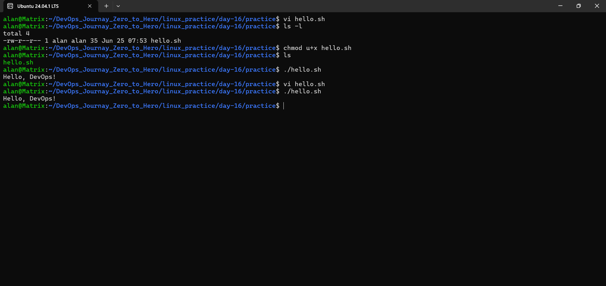
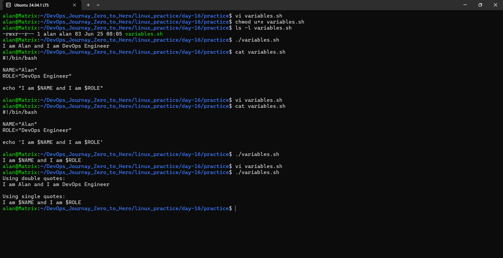
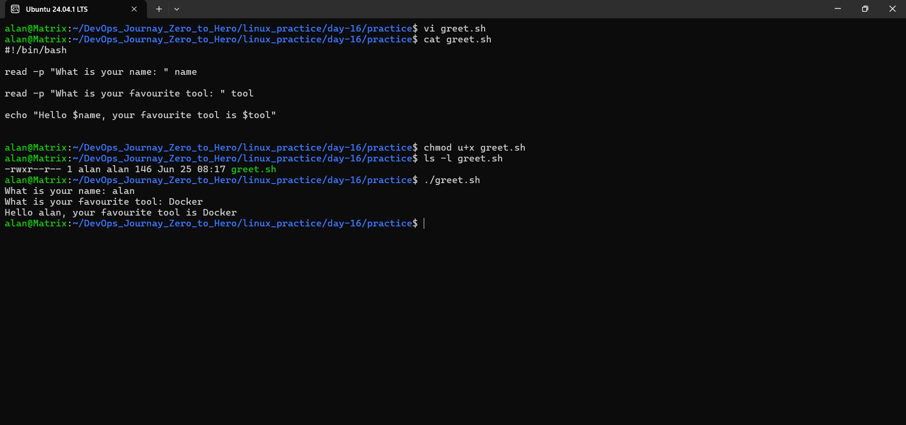
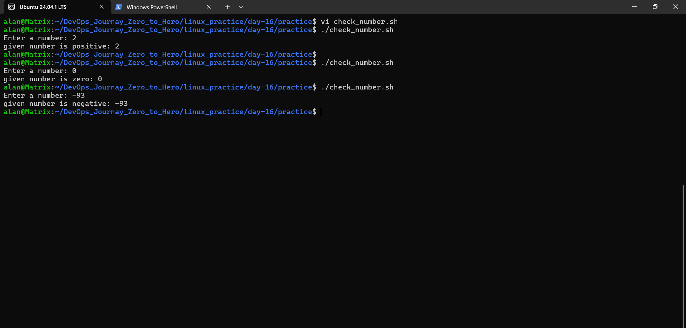
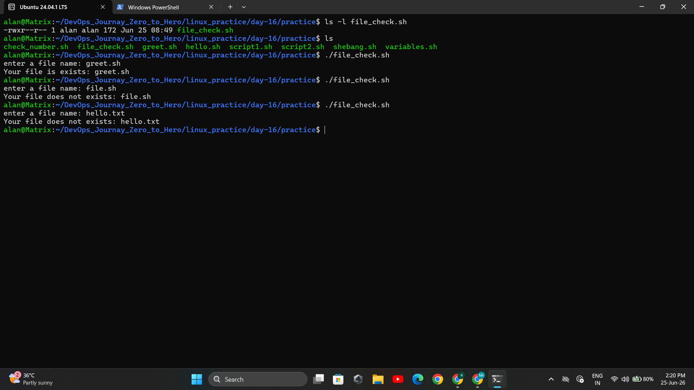
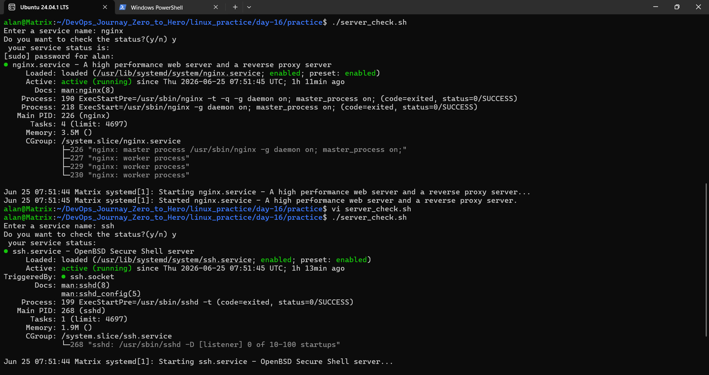

# Day 16 – Shell Scripting Basics

## Task

Start your shell scripting journey and learn the fundamentals every script needs.

### Objectives

- Understand shebang (`#!/bin/bash`) and why it matters
- Work with variables, `echo`, and `read`
- Write basic `if-else` conditions

---

# Introduction

## What is a Shell?

A shell is a program that allows users to interact with the Linux operating system by typing commands.

When you type commands such as:

```bash
ls
pwd
mkdir test
```

the shell receives the command, interprets it, and asks the operating system to execute it.

Common Linux shells:

- Bash (Bourne Again Shell)
- Sh (Bourne Shell)
- Zsh (Z Shell)
- Fish

In DevOps, Bash is the most commonly used shell.

---

## Why Do We Use a Shell?

A shell helps us:

- Run Linux commands
- Automate repetitive tasks
- Manage files and directories
- Monitor servers
- Deploy applications
- Create scripts for automation

Without a shell, administrators would need to perform every task manually.

---

## What is Shell Scripting?

A shell script is a file containing a sequence of Linux commands that are executed automatically.

Example:

```bash
#!/bin/bash

echo "Hello DevOps"
```

Instead of typing commands one by one, we save them in a script and execute them whenever needed.

---

## Why is Shell Scripting Important for DevOps?

Shell scripting is used for:

- Server administration
- Log management
- Application deployment
- Backup automation
- Health checks
- Monitoring

It is one of the fundamental skills every DevOps Engineer should learn and they have good hands on practice.

---

# Task 1: Your First Script

## Objective

Learn:

- Shebang (`#!/bin/bash`)
- `echo` command
- Executing a shell script

---

## Script: hello.sh

```bash
#!/bin/bash

echo "Hello, DevOps!"
```

---

## Make Script Executable

```bash
chmod +x hello.sh
```

---

## Run Script

```bash
./hello.sh
```

---

## Output

```text
Hello, DevOps!
```

---

## What is a Shebang?

```bash
#!/bin/bash
```

### What

Specifies which interpreter should execute the script.

### Why

Ensures the script runs using Bash.

### How

When the script is executed:

```bash
./hello.sh
```

Linux reads:

```bash
#!/bin/bash
```

and runs:

```bash
/bin/bash hello.sh
```

---

## What Happens if We Remove the Shebang?

The script may still work when executed from a Bash shell because Bash may automatically interpret it.

However:

- It becomes unreliable
- Other shells may fail
- Automation tools may execute it incorrectly

Best practice:

```bash
#!/bin/bash
```

should always be included.

---

### Screenshot



---

# Task 2: Variables

## Objective

Learn:

- Variables
- String interpolation
- Single vs Double Quotes

---

## Script: variables.sh

```bash
#!/bin/bash

NAME="Suraj"
ROLE="DevOps Engineer"

echo "Hello, I am $NAME and I am a $ROLE"
```

---

## Output

```text
Hello, I am Suraj and I am a DevOps Engineer
```

---

## What is a Variable?

A variable stores data.

Example:

```bash
NAME="Suraj"
```

---

## Why Use Variables?

Instead of repeating values:

```bash
echo "Suraj"
echo "Suraj"
```

Use:

```bash
echo "$NAME"
```

This makes scripts easier to maintain.

---

## Single Quotes vs Double Quotes

### Double Quotes

```bash
echo "Hello $NAME"
```

Output:

```text
Hello Suraj
```

Variables are expanded.

---

### Single Quotes

```bash
echo 'Hello $NAME'
```

Output:

```text
Hello $NAME
```

Variables are treated as plain text.

---

### Screenshot



---

# Task 3: User Input with read

## Objective

Learn:

- `read` command
- User input handling

---

## Script: greet.sh

```bash
#!/bin/bash

read -p "What is your name: " name

read -p "What is your favourite tool: " tool

echo "Hello $name, your favourite tool is $tool"
```

---

## Example Run

```text
What is your name: Suraj
What is your favourite tool: Docker

Hello Suraj, your favourite tool is Docker
```

---

## What is read?

### What

Reads input from the user.

### Why

Allows scripts to interact with users.

### How

```bash
read -p "Enter Name: " name
```

Stores user input in the variable `name`.

---

### Screenshot



---

# Task 4: If-Else Conditions

## Objective

Learn:

- Decision making
- Numeric comparison
- File existence checks

---

## Part A: check_number.sh

### Script

```bash
#!/bin/bash

read -p "Enter a number: " num1

num2=0

if [ "$num1" -gt "$num2" ]; then
    echo "Given number is positive: $num1"

elif [ "$num1" -eq "$num2" ]; then
    echo "Given number is zero: $num1"

else
    echo "Given number is negative: $num1"
fi
```

---

## Operators Used

| Operator | Meaning |
|-----------|-----------|
| `-gt` | Greater Than |
| `-lt` | Less Than |
| `-eq` | Equal To |
| `-ne` | Not Equal To |

---

## Example Output

```text
Enter a number: 10
Given number is positive: 10
```

---

### Screenshot



---

## Part B: file_check.sh

### Script

```bash
#!/bin/bash

read -p "Enter a file name: " file

if [ -f "$file" ]; then
    echo "File exists: $file"
else
    echo "File does not exist: $file"
fi
```

---

## What is `-f`?

### What

Checks whether a file exists and is a regular file.

### Why

Useful before reading or modifying files.

---

## Example Output

```text
Enter a file name: hello.sh

File exists: hello.sh
```

---

### Screenshot



---

# Task 5: Combine It All

## Objective

Combine:

- Variables
- User Input
- Conditions
- System Commands

---

## Script: server_check.sh

```bash
#!/bin/bash

service="ssh"

read -p "Do you want to check the status? (y/n): " check

if [ "$check" = "y" ]; then

    if systemctl is-active --quiet "$service"; then
        echo "$service service is active"
    else
        echo "$service service is inactive"
    fi

else
    echo "Skipped."
fi
```

---

## Example Run

```text
Do you want to check the status? (y/n): y

ssh service is active
```

---

## Concepts Used

### Variable

```bash
service="ssh"
```

Stores the service name.

### User Input

```bash
read -p
```

Reads user input.

### String Comparison

```bash
[ "$check" = "y" ]
```

Checks if the user entered `y`.

### Service Status Check

```bash
systemctl is-active --quiet ssh
```

Checks whether the service is active.

---

### Screenshot




---

# Key Learnings

By completing Day 16, I learned:

- What a shell is and why it is used
- What shell scripting is
- How shebang works
- How to create and use variables
- Difference between single and double quotes
- How to accept user input using `read`
- How to use `if`, `elif`, and `else`
- How to compare numbers and strings
- How to check whether a file exists using `-f`
- How to check service status using `systemctl`
- How to combine multiple shell scripting concepts into a practical automation script

---

# Files Submitted

```text
day-16-shell-scripting.md
hello.sh
variables.sh
greet.sh
check_number.sh
file_check.sh
server_check.sh
```
