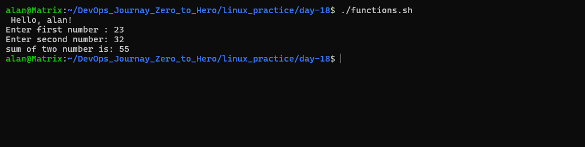
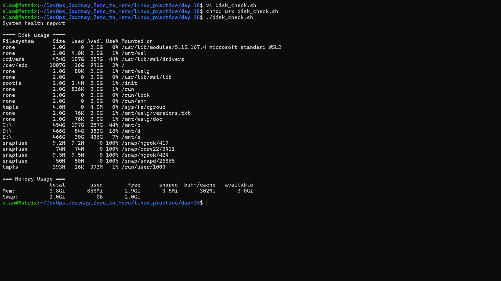
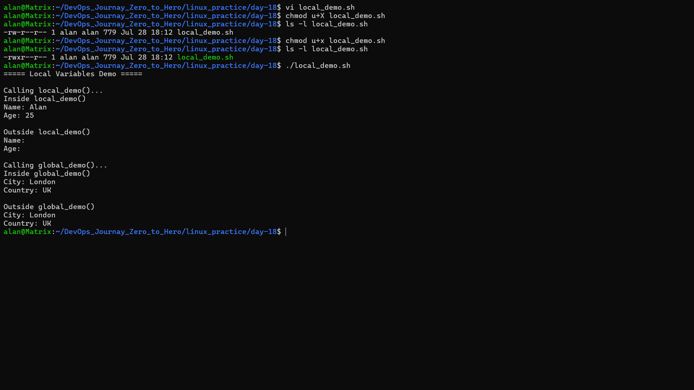
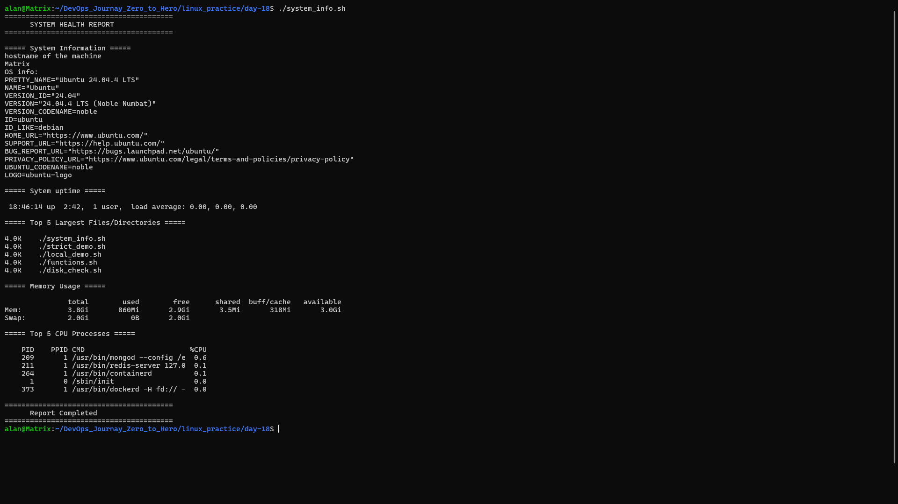

# Day 18 – Bash Scripting: Functions & Strict Mode

## 📌 Overview

I learned how to write modular Bash scripts using functions, pass arguments, use local variables, enable Strict Mode for safer scripts, and build a complete **System Information Reporter**.

---

# 🧠 What I Learned

- Creating and calling Bash functions
- Passing arguments to functions using `$1`, `$2`
- Using arithmetic expansion with `$(( ))`
- Creating reusable scripts
- Using `local` variables inside functions
- Understanding global variables
- Writing safer scripts with `set -euo pipefail`
- Monitoring Linux system resources using Bash
- Organizing scripts with a `main()` function

---

# ✅ Task 1 – Basic Functions

### Objective

Create a script named `functions.sh` that:

- Creates a `greet()` function
- Creates an `add()` function
- Calls both functions

### Script

```bash
#!/bin/bash

greet() {
    echo "Hello, $1!"
}

add() {
    read -p "Enter first number: " num1
    read -p "Enter second number: " num2

    echo "Sum: $((num1 + num2))"
}

greet "Alan"
add
```

### Output



---

# ✅ Task 2 – Functions with Return Values

### Objective

Create `disk_check.sh` that prints

- Disk Usage
- Memory Usage

### Script

```bash
#!/bin/bash

check_disk() {
    echo "===== Disk Usage ====="
    df -h
}

check_memory() {
    echo
    echo "===== Memory Usage ====="
    free -h
}

echo "System Health Report"
echo "--------------------"

check_disk
check_memory
```

### Output



---

# ✅ Task 3 – Strict Mode (`set -euo pipefail`)

## Objective

Create `strict_demo.sh` to understand how Bash **Strict Mode** handles different types of errors.

```bash
#!/bin/bash

set -euo pipefail

echo "===== Strict Mode Demo ====="

echo ""
echo "Demo 1: Undefined Variable"

echo "$username"

echo ""
echo "Demo 2: Failed Command"

ls /folder_that_does_not_exist

echo ""
echo "Demo 3: Pipeline Failure"

cat missing_file.txt | grep "hello"

echo "Pipeline completed."
```

---

## How I Tested This Task

Since **Strict Mode stops the script as soon as it encounters an error**, it is **not possible to test all three demos in a single run**.

To understand each option, I tested them **one at a time**:

### Test 1 – `set -u`

I commented out Demo 2 and Demo 3, then ran the script.

Code tested:

```bash
echo "$username"
```

Output:

```text
bash: username: unbound variable
```

**Result:** `set -u` stopped the script because `username` was not defined.

---

### Test 2 – `set -e`

Next, I commented out Demo 1 and Demo 3, leaving only:

```bash
ls /folder_that_does_not_exist
```

Output:

```text
ls: cannot access '/folder_that_does_not_exist': No such file or directory
```

**Result:** `set -e` stopped the script immediately after the command failed.

---

### Test 3 – `set -o pipefail`

Finally, I commented out Demo 1 and Demo 2, leaving only:

```bash
cat missing_file.txt | grep "hello"
```

Output:

```text
cat: missing_file.txt: No such file or directory
```

**Result:** The pipeline failed because the first command (`cat`) failed. With `set -o pipefail`, Bash treated the entire pipeline as failed.

---

## What does each flag do?

| Flag | Purpose |
|------|---------|
| `set -e` | Exit immediately if a command fails. |
| `set -u` | Treat undefined variables as an error. |
| `set -o pipefail` | Make the entire pipeline fail if any command in the pipeline fails. |

---

# ✅ Task 4 – Local Variables

### Objective

Understand the difference between local and global variables.

### Script

```bash
#!/bin/bash

local_demo() {
    local name="Alan"
    local age=25

    echo "$name"
    echo "$age"
}

global_demo() {
    city="London"
    country="UK"
}

local_demo

echo "$name"

global_demo

echo "$city"
```

### Output



### Observation

- Local variables exist only inside their function.
- Global variables remain available after the function finishes.

---

# ✅ Task 5 – System Information Reporter

### Objective

Create a complete monitoring script using functions.

Features

- Hostname
- OS Information
- System Uptime
- Top 5 Largest Files/Folders
- Memory Usage
- Top 5 CPU Processes
- Strict Mode
- Main Function

### Script Structure

```
system_info()

system_uptime()

disk_usage()

memory_usage()

top_cpu_processes()

main()
```

### Main Function

```bash
main() {

    echo "========================================"
    echo "SYSTEM HEALTH REPORT"
    echo "========================================"

    system_info

    system_uptime

    disk_usage

    memory_usage

    top_cpu_processes

}
```

### Output



---

# 📚 Commands Used

| Command | Purpose |
|----------|----------|
| `chmod +x` | Make script executable |
| `./script.sh` | Execute script |
| `df -h` | Display disk usage |
| `free -h` | Display memory usage |
| `hostname` | Show system hostname |
| `uptime` | Show system uptime |
| `du -sh` | Calculate directory sizes |
| `sort -hr` | Sort by largest size |
| `head -n 5` | Display first five lines |
| `ps -eo pid,ppid,cmd,%cpu --sort=-%cpu` | Show CPU-consuming processes |
| `cat /etc/os-release` | Display OS information |

---

# ⚠️ Challenges Faced

- Learned the difference between local and global variables.
- Accidentally used `pip` instead of `pid` in the `ps` command.
- Called an incorrect function name (`cpu_process`) which caused a `command not found` error.
- Understood how `set -u` stops scripts when using undefined variables.
- Learned why `set -o pipefail` is important when working with pipelines.

---

# 🎯 Key Takeaways

- Functions improve code reusability and readability.
- Arguments make functions dynamic.
- Local variables prevent unwanted changes outside functions.
- Strict Mode (`set -euo pipefail`) helps write safer and more reliable scripts.
- A `main()` function organizes script execution cleanly.
- Linux utilities like `df`, `free`, `uptime`, `ps`, and `du` are powerful tools for system monitoring.

---

## Connect With Me

If you're also learning Linux and DevOps, feel free to connect and share your journey!

⭐ If you found this helpful, consider starring the repository.
