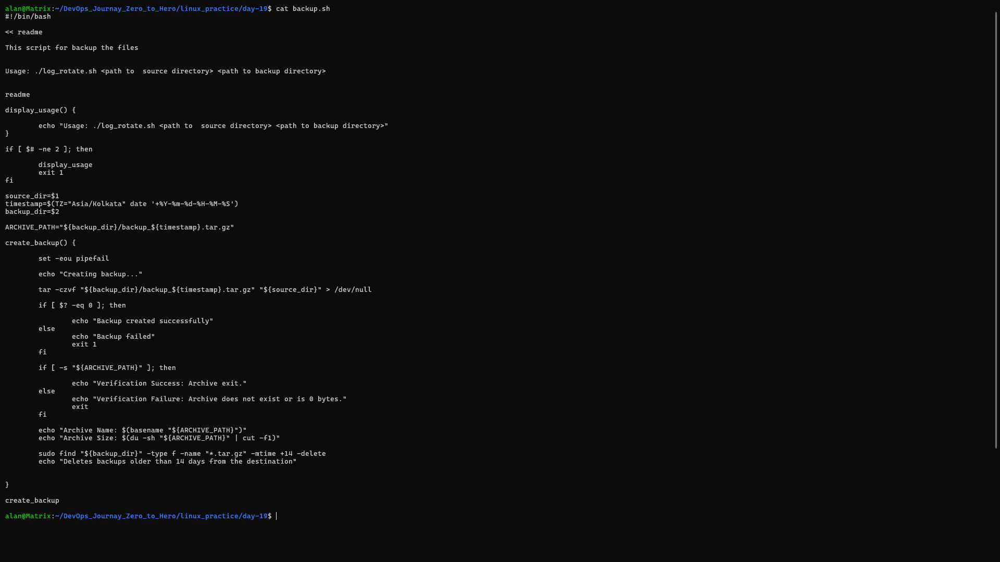
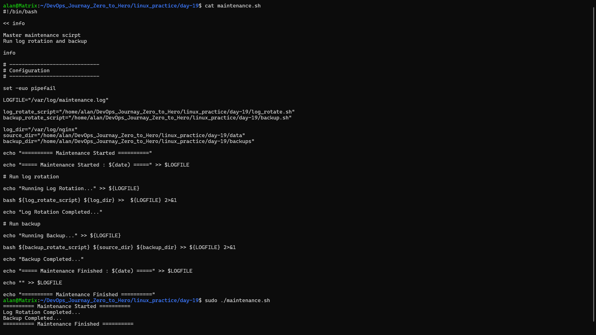
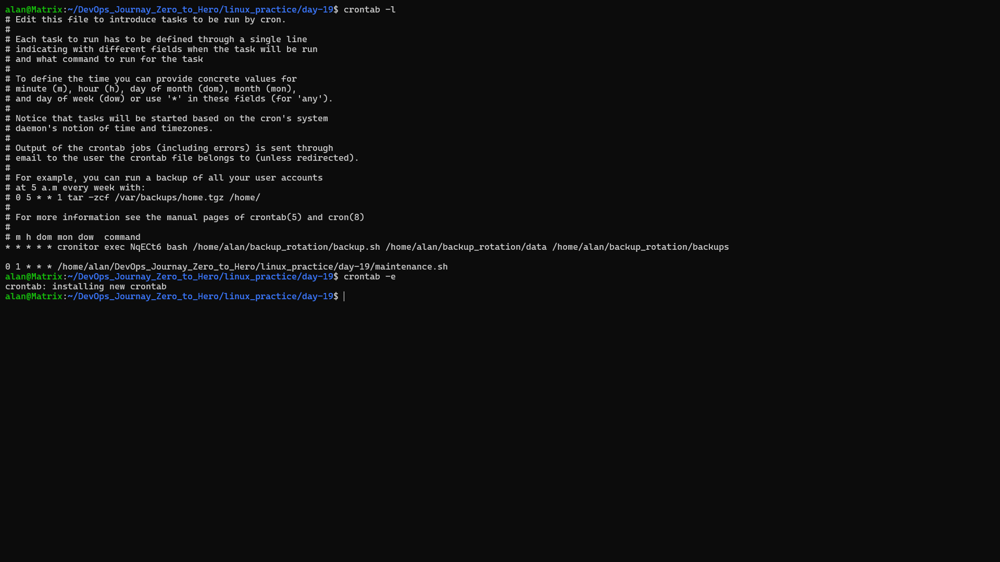

# Day 19 - Linux Automation Project
## Log Rotation, Backup & Scheduled Maintenance

---

# Objective

System administrators often perform repetitive maintenance tasks such as rotating logs, creating backups, and monitoring servers. Doing these tasks manually every day is time-consuming and can lead to mistakes if forgotten.

In this project, I automated these routine administration tasks using **Bash scripting** and **Cron**, allowing Linux to perform them automatically at scheduled times. This improves system reliability, saves storage space, protects important data through regular backups, and reduces manual effort.

The main objectives of this project are:

- Automate log management by compressing and removing old log files.
- Create regular backups of important directories.
- Verify that backups are created successfully.
- Schedule maintenance tasks using Cron.
- Record maintenance activities in a log file for monitoring and troubleshooting.
- Learn how Linux automation simplifies system administration.

---

# Task 1 - Log Rotation Script

## Requirements

- Accept a log directory as an argument.
- Compress `.log` files older than 7 days.
- Delete compressed `.gz` files older than 30 days.
- Print how many files were compressed.
- Print how many files were deleted.
- Exit with an error if the directory does not exist.

---

## log_rotate.sh

```bash
#!/bin/bash

<< README

Log Rotation Script

Compresses .log files older than 7 days.
Deletes .gz files older than 30 days.

Usage:
./log_rotate.sh <log_directory>

README

display_usage() {
    echo "Usage: ./log_rotate.sh <log_directory>"
}

if [ $# -ne 1 ]; then
    display_usage
    exit 1
fi

LOG_DIR="$1"

# Check directory exists
if [ ! -d "$LOG_DIR" ]; then
    echo "Error: Directory '$LOG_DIR' does not exist."
    exit 1
fi

# Check root user
if [ "$EUID" -ne 0 ]; then
    echo "Please run with sudo."
    exit 1
fi

perform_log_rotation() {

    set -euo pipefail

    compressed_count=$(find "$LOG_DIR" -type f -name "*.log" -mtime +7 | wc -l)

    echo "Compressing logs older than 7 days..."

    find "$LOG_DIR" -type f -name "*.log" -mtime +7 -exec gzip {} \;

    echo "Compressed $compressed_count log files."

    deleted_count=$(find "$LOG_DIR" -type f -name "*.gz" -mtime +30 | wc -l)

    echo "Deleting compressed logs older than 30 days..."

    find "$LOG_DIR" -type f -name "*.gz" -mtime +30 -delete

    echo "Deleted $deleted_count compressed log files."

    echo "==============================="
    echo "Log rotation completed successfully."
}

perform_log_rotation
```

---

# Sample Output


---

# Task 2 - Server Backup Script

## Requirements

- Accept source directory.
- Accept backup destination.
- Create timestamped archive.
- Verify archive creation.
- Print archive name.
- Print archive size.
- Delete backups older than 14 days.
- Exit if source directory doesn't exist.

---

## backup.sh

```bash
#!/bin/bash

<< README

Backup Script

Usage:
./backup.sh <source_directory> <backup_directory>

README

display_usage() {

    echo "Usage: ./backup.sh <source_directory> <backup_directory>"

}

if [ $# -ne 2 ]; then
    display_usage
    exit 1
fi

source_dir="$1"
backup_dir="$2"

if [ ! -d "$source_dir" ]; then
    echo "Error: Source directory '$source_dir' does not exist."
    exit 1
fi

if [ ! -d "$backup_dir" ]; then
    echo "Error: Backup directory '$backup_dir' does not exist."
    exit 1
fi

timestamp=$(TZ="Asia/Kolkata" date '+%Y-%m-%d-%H-%M-%S')

ARCHIVE_PATH="${backup_dir}/backup_${timestamp}.tar.gz"

create_backup() {

    set -euo pipefail

    echo "Creating backup..."

    tar -czf "$ARCHIVE_PATH" "$source_dir"

    if [ -s "$ARCHIVE_PATH" ]; then
        echo "Backup created successfully."
    else
        echo "Backup failed."
        exit 1
    fi

    echo "Archive Name : $(basename "$ARCHIVE_PATH")"
    echo "Archive Size : $(du -sh "$ARCHIVE_PATH" | cut -f1)"

    find "$backup_dir" -type f -name "*.tar.gz" -mtime +14 -delete

    echo "Deleted backups older than 14 days."

}

create_backup
```

---

# Sample Output



---

# Task 3 - Crontab

## Check Existing Cron Jobs

```bash
crontab -l
```

---

## Cron Syntax

```
* * * * * command
│ │ │ │ │
│ │ │ │ └── Day of week (0-7)
│ │ │ └──── Month (1-12)
│ │ └────── Day of month (1-31)
│ └──────── Hour (0-23)
└────────── Minute (0-59)
```

---

## Open Crontab

```bash
crontab -e
```

---

## Run Log Rotation Daily at 2 AM

```cron
0 2 * * * /home/alan/DevOps_Journay_Zero_to_Hero/linux_practice/day-19/log_rotate.sh /var/log/nginx
```

---

## Run Backup Every Sunday at 3 AM

```cron
0 3 * * 0 /home/alan/DevOps_Journay_Zero_to_Hero/linux_practice/day-19/backup.sh /home/alan/DevOps_Journay_Zero_to_Hero/linux_practice/day-19/data /home/alan/DevOps_Journay_Zero_to_Hero/linux_practice/day-19/backups
```

---

## Run Health Check Every 5 Minutes

```cron
*/5 * * * * /home/alan/DevOps_Journay_Zero_to_Hero/linux_practice/day-19/health_check.sh
```

---

# Task 4 - Scheduled Maintenance Script

## Requirements

- Run log rotation.
- Run backup.
- Save output into `/var/log/maintenance.log`.
- Add timestamps.
- Create cron entry to run daily at 1 AM.

---

## maintenance.sh

```bash
#!/bin/bash

set -euo pipefail

LOGFILE="/var/log/maintenance.log"

LOG_ROTATE_SCRIPT="/home/alan/DevOps_Journay_Zero_to_Hero/linux_practice/day-19/log_rotate.sh"

BACKUP_SCRIPT="/home/alan/DevOps_Journay_Zero_to_Hero/linux_practice/day-19/backup.sh"

LOG_DIR="/var/log/nginx"

SOURCE_DIR="/home/alan/DevOps_Journay_Zero_to_Hero/linux_practice/day-19/data"

BACKUP_DIR="/home/alan/DevOps_Journay_Zero_to_Hero/linux_practice/day-19/backups"

echo "===== Maintenance Started : $(date) =====" >> "$LOGFILE"

echo "Running Log Rotation..." >> "$LOGFILE"

bash "$LOG_ROTATE_SCRIPT" "$LOG_DIR" >> "$LOGFILE" 2>&1

echo "Running Backup..." >> "$LOGFILE"

bash "$BACKUP_SCRIPT" "$SOURCE_DIR" "$BACKUP_DIR" >> "$LOGFILE" 2>&1

echo "===== Maintenance Finished : $(date) =====" >> "$LOGFILE"

echo "" >> "$LOGFILE"
```

---

# Sample maintenance.sh




---

# Cron Entry for Maintenance Script

```cron
0 1 * * * /home/alan/DevOps_Journay_Zero_to_Hero/linux_practice/day-19/maintenance.sh
```



---

# Commands Used

```bash
find
gzip
tar
du
basename
date
crontab -l
crontab -e
wc
bash
```

---

---

# Challenges Faced

### 1. Counting Compressed and Deleted Files
- Initially, the script compressed and deleted files successfully but did not display how many files were processed.
- I learned to use `find` with `wc -l` to count matching files before performing the operations.

### 2. Verifying Backup Creation
- I needed to ensure that the backup archive was created successfully before considering the task complete.
- I used the `-s` test operator to verify that the archive exists and is not empty.

### 3. Handling Invalid Directories
- The scripts could fail if the source or log directory did not exist.
- I added directory validation using `-d` and exited with an appropriate error message.

### 4. Understanding Cron Scheduling
- Learning the five fields of a cron expression was initially confusing.
- After practicing different examples, I understood how to schedule scripts to run automatically at specific times.

### 5. Logging Script Output
- I learned how to redirect both standard output and error messages to a log file using:
  ```bash
  >> logfile 2>&1
  ```
- This makes it easier to monitor scheduled jobs and troubleshoot failures.

---

# What I Learned

### 1. Automating Log Management
- Used `find` with `mtime` to locate old log files.
- Compressed old logs using `gzip`.
- Removed old compressed logs automatically to save disk space.

### 2. Creating Reliable Backups
- Created timestamped `.tar.gz` archives using `tar`.
- Verified backup integrity before reporting success.
- Automated cleanup of backups older than 14 days.

### 3. Scheduling Tasks with Cron
- Learned the structure of cron expressions.
- Created scheduled jobs for log rotation, backups, health checks, and maintenance.
- Understood how Linux can automate repetitive administrative tasks.

### 4. Writing More Reliable Bash Scripts
- Used `set -euo pipefail` to make scripts safer.
- Added input validation and meaningful error messages.
- Organized code into reusable functions for better readability and maintenance.

### 5. Logging and Monitoring
- Redirected script output to `/var/log/maintenance.log`.
- Added timestamps to logs to track when maintenance tasks started and finished.
- Learned the importance of logging for troubleshooting and system administration.

---
