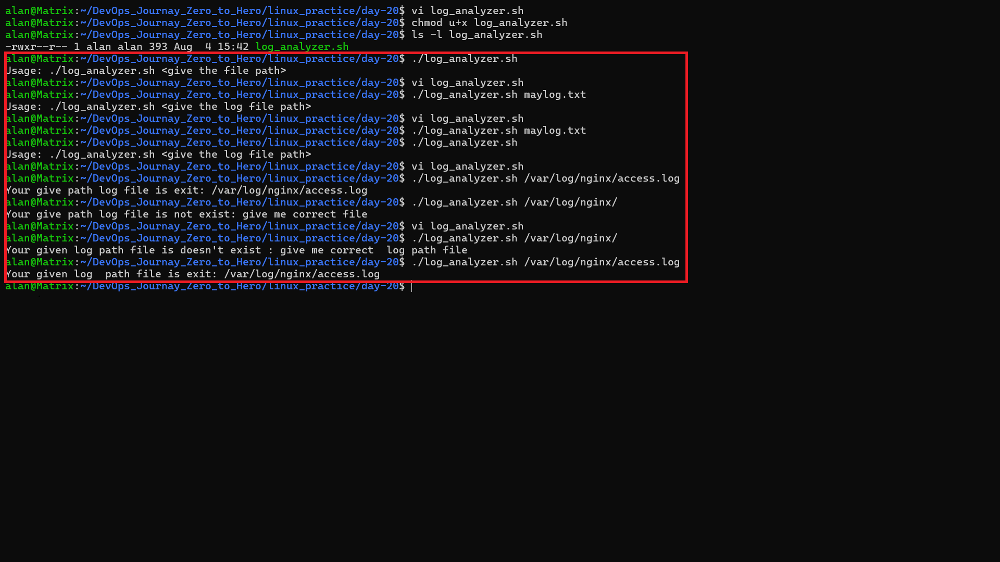
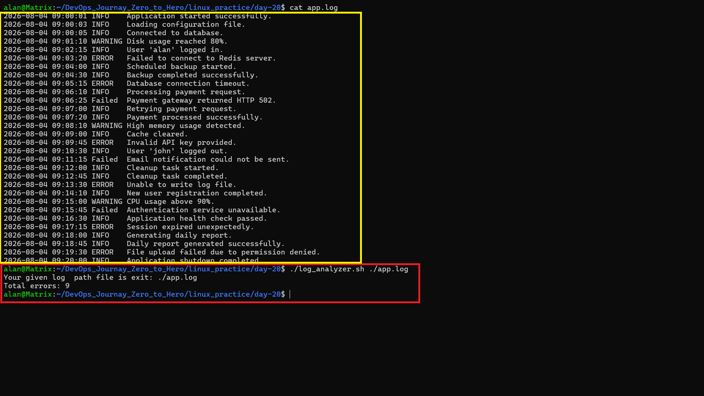
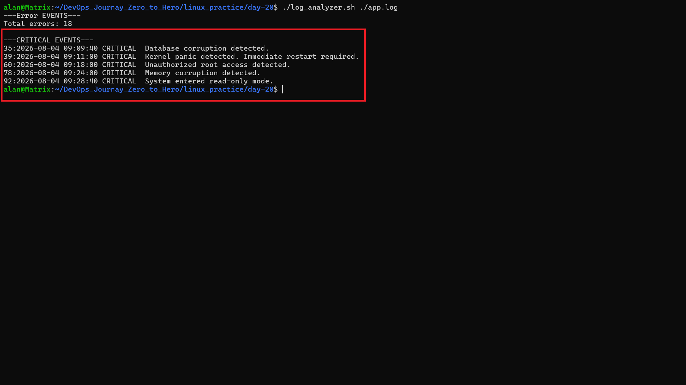
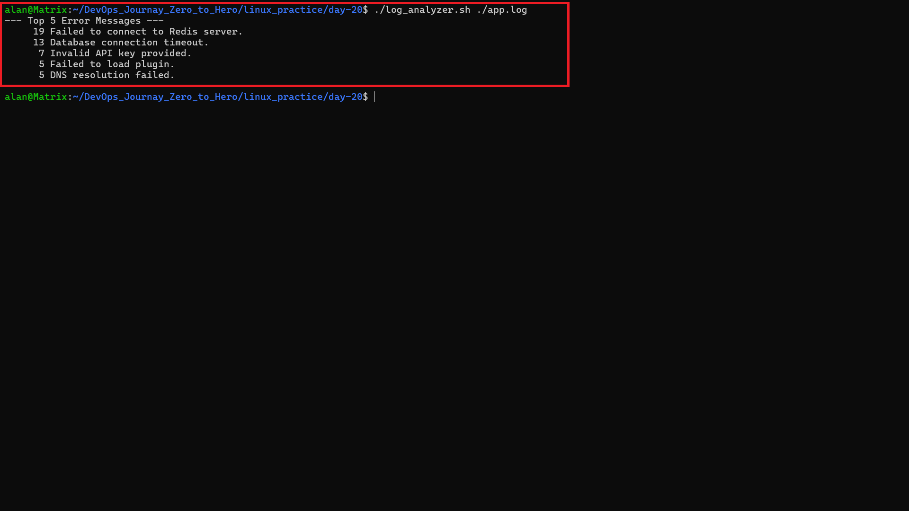
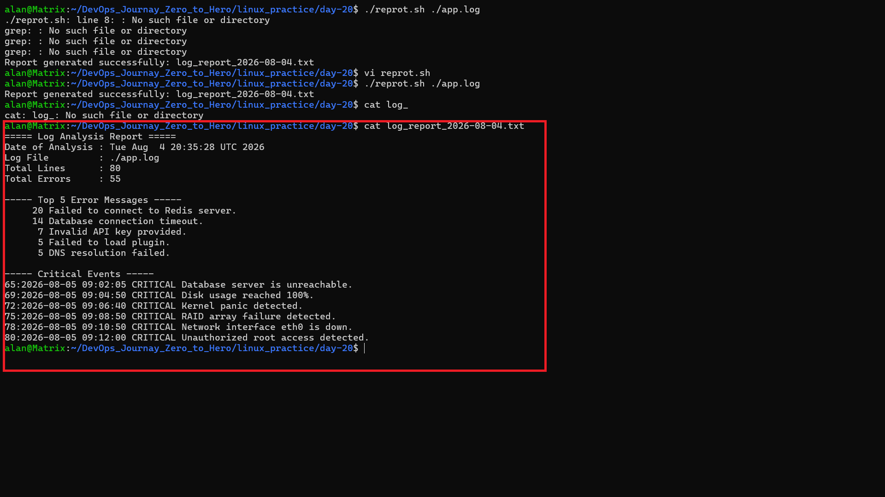

# Day 20 – Bash Scripting Challenge: Log Analyzer and Report Generator

## Objective

The goal of this challenge was to create a Bash script that can analyze a log file and generate a summary report automatically. This task helped me practice text processing, file handling, and command-line tools in Linux.

---

# Files

* `log_analyzer.sh` – Bash script to analyze the log file.
* `app.log` – Sample log file used for testing.
* `log_report_<date>.txt` – Generated summary report.
* `README.md` – Documentation for this challenge.

---

# Tasks Completed

## ✅ Task 1 – Input Validation

Completed:

* Accepted the log file path as a command-line argument.
* Checked whether the user provided an argument.
* Checked whether the log file exists.
* Displayed an error message if the input was invalid.

---

## Output



---

## ✅ Task 2 – Error Count

Completed:

* Counted all lines containing **ERROR** or **Failed**.
* Printed the total error count on the terminal.

---

## Output



---

## ✅ Task 3 – Critical Events

Completed:

* Searched for all **CRITICAL** events.
* Printed the matching lines with their line numbers.

---

## Output



---

## ✅ Task 4 – Top 5 Error Messages

Completed:

* Extracted all **ERROR** messages.
* Removed the date, time, and log level.
* Counted duplicate error messages.
* Displayed the top 5 most common error messages in descending order.

---

## Output



---

## ✅ Task 5 – Summary Report

Completed:

Generated a report file named:

```text
log_report_<date>.txt
```

The report contains:

* Date of analysis
* Log file name
* Total lines processed
* Total error count
* Top 5 error messages
* Critical events with line numbers

---

## Output



---

# Commands Used

## File and Script Commands

```bash
touch log_analyzer.sh
chmod +x log_analyzer.sh
./log_analyzer.sh app.log
```

## Input Validation

```bash
if [ $# -ne 1 ]
```

```bash
if [ ! -f "$LOG_FILE" ]
```

## Count Total Errors

```bash
grep -iE -c "ERROR|Failed" "$LOG_FILE"
```

## Find Critical Events

```bash
grep -in "CRITICAL" "$LOG_FILE"
```

## Find Top 5 Error Messages

```bash
grep -i "ERROR" "$LOG_FILE" | cut -d' ' -f4- | sort | uniq -c | sort -nr | head -5
```

## Count Total Lines

```bash
wc -l < "$LOG_FILE"
```

## Generate Report Name

```bash
date +%F
```

## Redirect Output to Report

```bash
{
...
} > "$REPORT_FILE"
```

---

# What I Learned

During this challenge, I learned:

* How to accept command-line arguments in a Bash script.
* How to validate user input.
* How to check whether a file exists.
* How to search text using `grep`.
* How to count matching lines.
* How to use `cut` to extract specific fields.
* Why `sort` is needed before using `uniq`.
* How `uniq -c` counts duplicate lines.
* How to use pipes (`|`) to combine multiple commands.
* How to generate a report file using output redirection.
* How to use variables inside a Bash script.

---

# Challenges I Faced

I faced a few challenges while completing this task:

* Understanding why `uniq -c` was showing a count of `1` for every error.
* Learning that timestamps made every log entry different.
* Figuring out how to extract only the error message using `cut`.
* Understanding why `sort` is required before `uniq`.
* Learning the difference between `grep`, `grep -i`, `grep -E`, and `grep -n`.
* Generating a report file with the required format.

After practicing and testing different commands, I was able to solve these problems.

---

# Output

I successfully generated:

* A working Bash script (`log_analyzer.sh`)
* A summary report (`log_report_<date>.txt`)
* Screenshots showing the script execution and output

---

# Conclusion

This challenge improved my Bash scripting skills and helped me understand how Linux commands can work together to analyze log files. I also learned how system administrators use Bash scripts to automate daily monitoring and reporting tasks.
