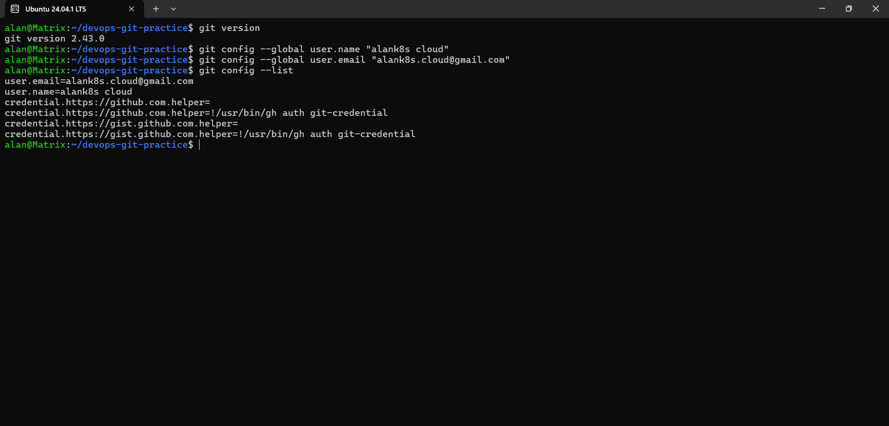
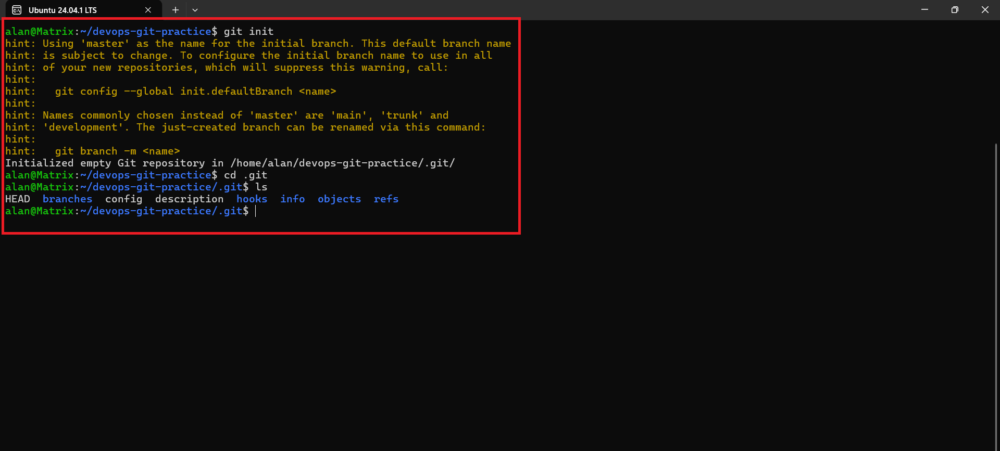
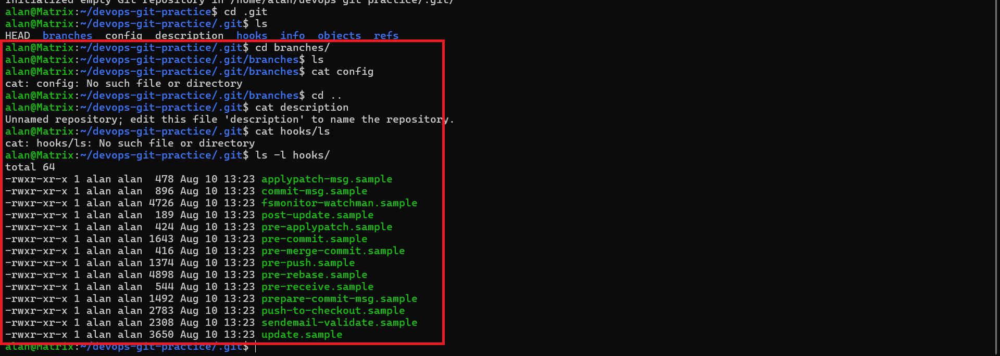
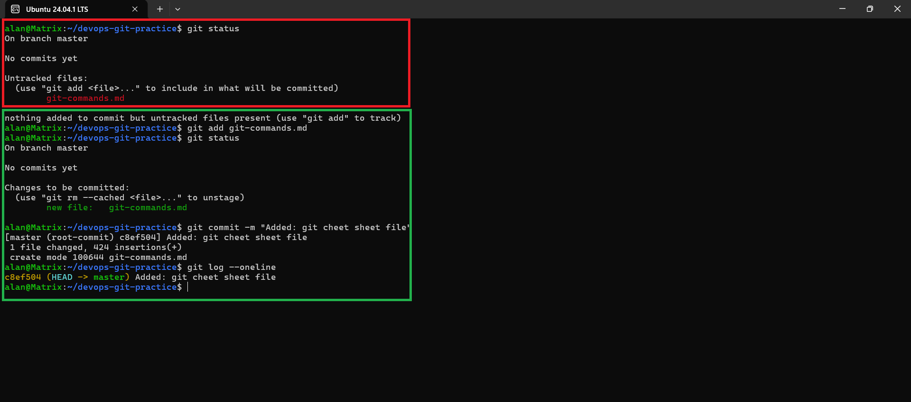
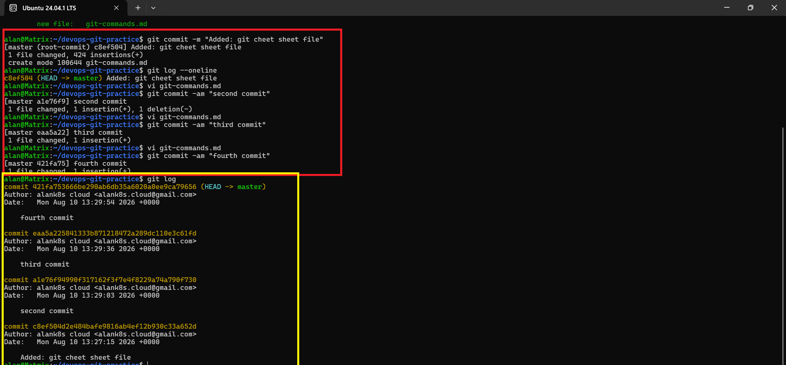

---

# Day 22 – Introduction to Git: Your First Repository

## 📌 What is Git?

**Git is a distributed version control system (VCS)** used to track changes in files and source code.

It allows developers to:

- Track what changed in a project
- See who made a change
- Go back to an older version
- Work safely on different features
- Create branches
- Collaborate with other developers
- Maintain a complete history of a project

### Simple Example

Imagine you are working on a project:

```text
project/
├── app.py
├── index.html
└── README.md
```

You modify `app.py` today, make another change tomorrow, and accidentally break something.

Without Git, finding the old working version can be difficult.

With Git, you can save versions:

```text
Commit 1 → Initial project
Commit 2 → Added login
Commit 3 → Added database
Commit 4 → Fixed login bug
```

You can inspect or restore previous versions when necessary.

---

# 🤔 Why Do We Use Git?

Git is important because modern software development involves many changes and many people.

### 1. Track Changes

Git records changes made to files.

```bash
git status
```

You can see which files are modified, untracked, or staged.

### 2. Save Versions

Git saves project versions using **commits**.

```bash
git commit -m "Add login feature"
```

Each commit represents a point in your project's history.

### 3. Go Back to Previous Versions

If something breaks, Git makes it possible to inspect previous versions and recover work.

### 4. Collaboration

Git allows multiple developers to work on the same project without constantly overwriting each other's work.

### 5. Branching

Developers can create separate branches for features or fixes.

```text
main
 │
 ├── feature-login
 │
 └── bugfix-header
```

### 6. DevOps

Git is one of the foundations of DevOps.

A typical DevOps workflow looks like:

```text
Developer
    ↓
Git
    ↓
GitHub / GitLab
    ↓
CI/CD Pipeline
    ↓
Build
    ↓
Test
    ↓
Deploy
    ↓
Production
```

Tools such as GitHub Actions, Jenkins, Docker, and Kubernetes are commonly used together with Git-based workflows.

---

# 🧠 Git vs GitHub

These two are related but are **not the same thing**.

| Git                    | GitHub                               |
| ---------------------- | ------------------------------------ |
| Version control system | Hosting and collaboration platform   |
| Runs locally           | Runs primarily as a web service      |
| Tracks project history | Hosts Git repositories               |
| Command-line tool      | Web interface + Git hosting          |
| `git commit`           | Pull Requests, Issues, Actions, etc. |

Example:

```text
Your Computer
     │
     │ Git
     ↓
Local Repository
     │
     │ git push
     ↓
GitHub Repository
```

---

# 🎯 Day 22 Goal

Today's goal is to understand the basic Git workflow:

```text
Working Directory
       ↓
    git add
       ↓
Staging Area
       ↓
   git commit
       ↓
Repository
```

You will:

- Understand Git
- Install/configure Git
- Create your first repository
- Understand `.git`
- Create `git-commands.md`
- Stage files
- Commit changes
- View history
- Make multiple commits
- Understand the Git workflow

---

# Task 1 – Install and Configure Git

## Step 1: Verify Git is Installed

Run:

```bash
git --version
```

### What does this command do?

It displays the installed Git version.

Example:

```text
git version 2.43.0
```

If you see a Git version, Git is installed correctly.

---

## Step 2: Configure Your Name And Email

Run:

```bash
git config --global user.name "alank8s cloud"
```

Example:

```bash
git config --global user.email "alank8s.cloud@gmail.com"
```

### Why?

Git records the author of each commit.

For example:

```text
Author: Alan <alank8s.cloud@example.com>
```

### Why?

Git associates your commits with an email address.

---

## Step 4: Verify Configuration

Run:

```bash
git config --global --list
```

You should see something similar to:

```text
user.name=Alan
user.email=alan.cloud@example.com
```

You can also check individual values:

```bash
git config --global user.name
```

```bash
git config --global user.email
```
---
# Output


---

# Task 2 – Create Your Git Project

## Step 1: Create the Project Directory

Run:

```bash
mkdir devops-git-practice
```

### What does `mkdir` do?

`mkdir` means **make directory**.

It creates a new folder.

---

## Step 2: Enter the Directory

```bash
cd devops-git-practice
```

### What does `cd` do?

`cd` means **change directory**.

It moves you into another directory.

---

## Step 3: Initialize Git

Run:

```bash
git init
```

You should see something similar to:

```text
Initialized empty Git repository in .../devops-git-practice/.git/
```

### What does `git init` do?

It converts the current directory into a Git repository.

Before:

```text
devops-git-practice/
```

After:

```text
devops-git-practice/
└── .git/
```

The `.git` directory contains Git's internal repository information.

---

## Step 4: Check Git Status

Run:

```bash
git status
```

You may see:

```text
On branch master

No commits yet

nothing to commit
```

or:

```text
On branch main

No commits yet

nothing to commit
```

### What does `git status` tell us?

It tells you the current state of your working directory and staging area.

It can show:

- Current branch
- Modified files
- Untracked files
- Staged files
- Changes ready to commit

---

# Step 5: Explore `.git`

Run:

```bash
ls -la
```

You should see:

```text
.
..
.git
```

Enter the directory:

```bash
cd .git
```

Then:

```bash
ls
```

You will see:

```text
HEAD
config
objects
refs
hooks
index
logs
```

Return to your project:

```bash
cd ..
```

---

## What is `.git/`?

`.git/` is the **Git repository database** inside your project.

It stores information required by Git, including:

- Commit information
- Branch references
- Repository configuration
- Staging information
- Git objects
- History

### Important

Do **not** manually modify files inside `.git` unless you know exactly what you are doing.

---
# Output





----
# Task 3 – Create `git-commands.md`

Create the file:

```bash
touch git-commands.md
```

Open it using your editor:

```bash
nano git-commands.md
```

Add your Git commands organized into categories.

---

# Git Commands Reference

## 1. Setup & Configuration

### `git --version`

**What:** Shows the installed Git version.

**Example:**

```bash
git --version
```

---

### `git config --global user.name`

**What:** Sets your Git username globally.

**Example:**

```bash
git config --global user.name "alank8s cloud"
```

---

### `git config --global user.email`

**What:** Sets your Git email globally.

**Example:**

```bash
git config --global user.email "alank8s.cloud@example.com"
```

---

### `git config --global --list`

**What:** Displays your global Git configuration.

**Example:**

```bash
git config --global --list
```

---

# 2. Basic Workflow

## `git init`

**What:** Initializes a Git repository.

**Example:**

```bash
git init
```

---

## `git status`

**What:** Shows the current state of your Git working directory.

**Example:**

```bash
git status
```

---

## `git add`

**What:** Moves changes from the working directory into the staging area.

**Example:**

```bash
git add git-commands.md
```

To stage everything:

```bash
git add .
```

---

## `git commit`

**What:** Saves the staged changes as a new commit in the repository.

**Example:**

```bash
git commit -m "Add Git commands reference"
```

---

## `git log`

**What:** Displays the commit history.

**Example:**

```bash
git log
```

---

# 3. Viewing Changes

## `git diff`

**What:** Shows changes that have not yet been staged.

**Example:**

```bash
git diff
```

---

## `git diff --staged`

**What:** Shows changes that are currently staged.

**Example:**

```bash
git diff --staged
```

---

## `git log --oneline`

**What:** Displays commit history in a short, compact format.

**Example:**

```bash
git log --oneline
```

Example output:

```text
a123456 Add viewing commands
b234567 Add basic Git commands
c345678 Add Git commands reference
```

---

# Task 4 – Stage and Commit

First check the repository:

```bash
git status
```

You should see:

```text
Untracked files:
    git-commands.md
```

---

## Step 1: Stage the File

Run:

```bash
git add git-commands.md
```

### What happened?

The file moved from:

```text
Working Directory
```

to:

```text
Staging Area
```

Check:

```bash
git status
```

You should see:

```text
Changes to be committed:
    new file: git-commands.md
```

---

## Step 2: Check Staged Changes

Run:

```bash
git diff --staged
```

---

## Step 3: Commit

Run:

```bash
git commit -m "Add Git commands reference"
```

---

## Step 4: View Commit History

Run:

```bash
git log
```

---

# Output



---
# Task 5 – Make More Changes and Build History

Your history should eventually look like:

```text
Commit 4 → Add viewing commands
Commit 3 → Add basic workflow commands
Commit 2 → Add setup commands
Commit 1 → Initial Git commands reference
```

---

## Change 1

```bash
git diff
git add git-commands.md
git commit -m "Added: git cheet sheet file"
```

---

## Change 2

```bash
git diff
git add git-commands.md
git commit -m "second"
```

---

## Change 3

```bash
git diff
git add git-commands.md
git commit -m "third"
```

## Change 4

```bash
git diff
git add git-commands.md
git commit -m "fourth commit"
```
---

## View Full History

```bash
git log --oneline
```

---
# Output



---

# Task 6 – Understand the Git Workflow

## Question 1: `git add` vs `git commit`

`git add` → prepares changes\
`git commit` → saves changes

---

## Question 2: Staging Area

Lets you choose what goes into a commit.

---

## Question 3: `git log`

Shows commit history.

---

## Question 4: `.git/` folder

Stores Git repository data.

---

## Question 5: Git Areas

### Working Directory

**What:** The place where you create, edit, or delete your project files.
**Why:** This is where you actually work on your project before saving changes to Git.
**Example:** You edit `app.py` and change `print("Hello")` to `print("Hello Git")`.
**Command:** `git status` — checks what changed in your Working Directory.

### Staging Area

**What:** A temporary area where you select changes that you want to include in the next commit.
**Why:** It lets you choose exactly which changes you want to save.
**Example:** `git add app.py` stages only the changes made to `app.py`.
**Command:** `git add app.py`

### Repository

**What:** The place where Git stores your committed project history.
**Why:** It keeps a record of your saved versions so you can view and manage your project's history.
**Example:** `git commit -m "Update app"` saves the staged changes as a commit.
**Command:** `git log` — shows your commit history.

### Simple Git Flow

```text
Working Directory
       ↓
    git add
       ↓
Staging Area
       ↓
   git commit
       ↓
Repository
```


---

# 🔄 Complete Git Workflow

```text
Edit
 ↓
git add
 ↓
Stage
 ↓
git commit
 ↓
Repository
```

---

# 🎯 Summary
# 🧩 Challenges Faced

During Day 22, I faced a few challenges while learning Git:

### 1. Understanding Git vs GitHub

At first, I thought Git and GitHub were the same thing.

I learned that **Git is a version control tool**, while **GitHub is a platform for hosting Git repositories and collaborating with others**.

### 2. Understanding the Staging Area

Initially, I was confused about why `git add` was required before `git commit`.

I learned that the staging area allows me to **select which changes I want to include in the next commit**.

### 3. Understanding Git Workflow

It was confusing to understand the difference between the Working Directory, Staging Area, and Repository.

After practicing, I understood the flow:

```text
Working Directory
       ↓
    git add
       ↓
Staging Area
       ↓
   git commit
       ↓
Repository
```

### 4. Understanding `.git` Directory

I learned that `.git` is a hidden directory created by `git init`.

It contains the information Git needs to manage the repository and its history.

### 5. Creating Multiple Commits

At first, I was not sure how to build a proper commit history.

By making changes, checking them with `git diff`, staging them with `git add`, and committing them with `git commit`, I understood how Git tracks project versions.

---

# 📚 What I Learned

By completing Day 22, I learned:

* What Git is and why it is used.
* The difference between Git and GitHub.
* How to install and verify Git.
* How to configure Git username and email.
* How to create a Git repository using `git init`.
* How to check repository status using `git status`.
* How to understand the Working Directory.
* How to use the Staging Area.
* How to stage changes using `git add`.
* How to create commits using `git commit`.
* How to view changes using `git diff`.
* How to view staged changes using `git diff --staged`.
* How to view commit history using `git log`.
* How to view compact history using `git log --oneline`.
* What the `.git` directory is.
* How Git tracks project history through commits.
* The basic Git workflow:

```text
Edit → Stage → Commit → History
```

### 🎯 Key Learning

The most important concept I learned today is:

> **Git helps me track and manage changes to my project safely through commits and history.**
