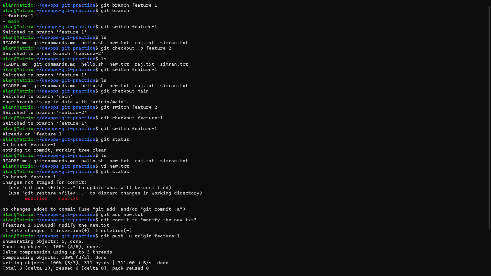
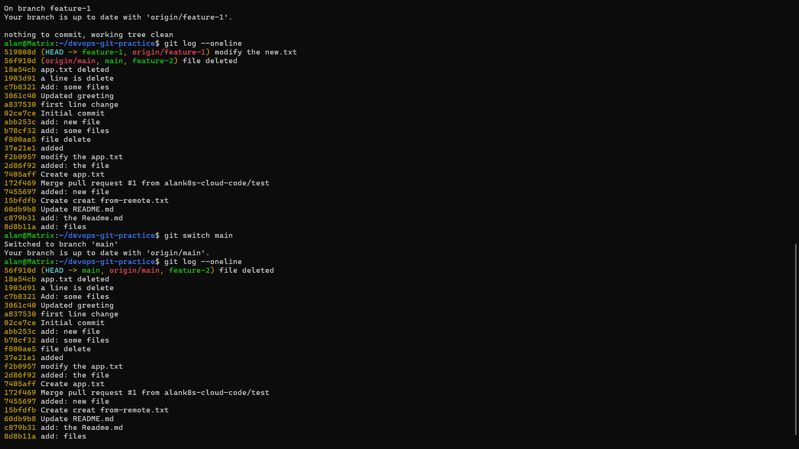
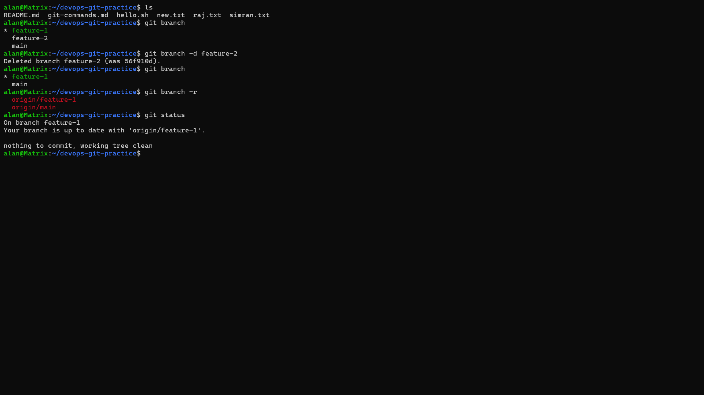

# Day 23 – Git Branching, Remotes, Clone & Fork Notes

---

# Task 1: Understanding Branches

## 1. What is a branch in Git?

### What?

A branch is an independent line of development in Git. It lets you work on changes without affecting the main project.

### Why?

Branches allow developers to work on new features, bug fixes, or experiments safely while keeping the `main` branch stable.

### How?

Create a new branch and work on it:

```bash
git branch feature-1
git switch feature-1
```

---

## 2. Why do we use branches instead of committing everything to `main`?

### What?

Instead of making all changes directly on `main`, developers create separate branches for different tasks.

### Why?

* Keeps the main branch stable.
* Prevents unfinished or broken code from affecting the project.
* Allows multiple developers to work simultaneously.
* Makes testing easier before merging changes.

### How?

```bash
git switch -c feature-login
```

Develop and commit your work on the new branch, then merge it into `main` after testing.

---

## 3. What is `HEAD` in Git?

### What?

`HEAD` is a pointer that tells Git your current location (current branch or current commit).

### Why?

Git uses `HEAD` to know where new commits should be added.

### How?

If you are on `main`:

```text
HEAD → main
```

If you switch to `feature-1`:

```text
HEAD → feature-1
```

Every new commit goes to the branch that `HEAD` points to.

---

## 4. What happens to your files when you switch branches?

### What?

Git changes your working directory to match the selected branch.

### Why?

Each branch has its own project history and files.

### How?

```bash
git switch feature-1
```

If `feature-1` contains a file named `login.html` and `main` does not:

Switching to `feature-1`:

```text
index.html
login.html
style.css
```

Switching back to `main`:

```text
index.html
style.css
```

The `login.html` file disappears because it only exists in `feature-1`.

---
---

# Task 2: Branching Commands – Hands-On

## 1. List all branches

```bash
git branch
```

---

## 2. Create a branch

```bash
git branch feature-1
```

---

## 3. Switch to feature-1

```bash
git switch feature-1
```

---

## 4. Create and switch to feature-2

```bash
git switch -c feature-2
```

---

## 5. Difference between `git switch` and `git checkout`

### What?

Both commands can switch branches.

### Why?

`git switch` was introduced because `git checkout` performs multiple jobs, making it confusing for beginners.

### How?

```bash
git switch main
```

Old command:

```bash
git checkout main
```

Main Difference:

| git switch             | git checkout                               |
| ---------------------- | ------------------------------------------ |
| Only switches branches | Switches branches and performs other tasks |
| Modern command         | Older multi-purpose command                |
| Easier for beginners   | More flexible but more complex             |

---

## 6. Make a commit on feature-1

```bash
git switch feature-1
echo "Feature 1" >> feature.txt
git add .
git commit -m "Add feature.txt"
```

---

## 7. Verify the commit is not on main

```bash
git switch main
git log --oneline
```

The commit created on `feature-1` will not appear because each branch has its own history.

---

## 8. Delete an unused branch

Safe delete

```bash
git branch -d feature-2
```

Force delete

```bash
git branch -D feature-2
```

---

## 9. Add branching commands to `git-commands.md`

Example:

```text
git branch
git branch feature-1
git switch feature-1
git switch -c feature-2
git branch -d feature-2
git branch -D feature-2
```

---

## 📸 Output







---

# Task 3: Push to GitHub

## 1. Create a GitHub repository

Create a new repository on GitHub.

Do **not** initialize it with a README.

---

## 2. Connect local repository

```bash
git remote add origin git@github.com:YOUR_USERNAME/devops-git-practice.git
```

Verify:

```bash
git remote -v
```

---

## 3. Push main

```bash
git push -u origin main
```

---

## 4. Push feature-1

```bash
git push -u origin feature-1
```

---

## 5. Verify on GitHub

Open your repository.

Click the branch selector.

Verify both:

* main
* feature-1

---

## Difference between origin and upstream

### What?

Both are remote repositories.

* **origin** → Your own GitHub repository.
* **upstream** → The original repository you forked from.

### Why?

`origin` is used to push your work.

`upstream` is used to receive updates from the original repository.

### How?

Check remotes:

```bash
git remote -v
```

Example:

```text
origin     git@github.com:alan/project.git

upstream   git@github.com:original/project.git
```

---

## 📸 Screenshot

**Add screenshots of:**

* GitHub repository
* Remote URLs (`git remote -v`)
* Both branches on GitHub

---

# Task 4: Pull from GitHub

## 1. Edit a file on GitHub

Open a file.

Click **Edit**.

Save the changes.

---

## 2. Pull the changes

```bash
git pull origin main
```

---

## Difference between `git fetch` and `git pull`

### What?

Both download changes from GitHub.

### Why?

* `git fetch` downloads changes only.
* `git pull` downloads and merges changes into your current branch.

### How?

Download only:

```bash
git fetch origin
```

Download and merge:

```bash
git pull origin main
```

Remember:

* **Fetch = Download**
* **Pull = Download + Merge**

---

## 📸 Screenshot

**Add screenshots of:**

* File edited on GitHub
* `git pull`
* Updated file locally

---

# Task 5: Clone vs Fork

## 1. Clone a public repository

```bash
git clone https://github.com/octocat/Hello-World.git
```

---

## 2. Fork the repository

Click **Fork** on GitHub.

Then clone your fork.

```bash
git clone git@github.com:YOUR_USERNAME/Hello-World.git
```

---

## Difference between Clone and Fork

### What?

* **Clone** creates a local copy of a repository.
* **Fork** creates your own copy of someone else's repository on GitHub.

### Why?

Clone is used to work locally.

Fork is used when contributing to repositories you don't own.

### How?

Clone:

```text
GitHub
   │
Clone
   ▼
Local Computer
```

Fork:

```text
Original Repository
       │
Fork
       ▼
Your GitHub Repository
       │
Clone
       ▼
Local Computer
```

---

## When would you clone vs fork?

### Clone

Use clone when:

* You own the repository.
* You already have write access.
* You simply need a local copy.

### Fork

Use fork when:

* You don't own the repository.
* You don't have permission to push.
* You want to contribute through a Pull Request.

---

## After forking, how do you keep your fork in sync?

### What?

Keep your fork updated with the latest changes from the original repository.

### Why?

To receive new features, bug fixes, and security updates.

### How?

Add the original repository:

```bash
git remote add upstream https://github.com/original-owner/project.git
```

Fetch updates:

```bash
git fetch upstream
```

Merge updates:

```bash
git merge upstream/main
```

Push updated branch to your fork:

```bash
git push origin main
```

---

## 📸 Screenshot

**Add screenshots of:**

* Original repository
* Forked repository
* Cloned repository
* `git remote -v`
* `git fetch upstream`
* `git merge upstream/main`

---

# Day 23 Summary

### Branch Commands

```bash
git branch
git branch feature-1
git switch feature-1
git switch -c feature-2
git branch -d feature-2
git branch -D feature-2
```

### Remote Commands

```bash
git remote -v
git remote add origin <repo-url>
git push -u origin main
git push -u origin feature-1
```

### Pull & Fetch

```bash
git fetch origin
git pull origin main
```

### Clone & Fork

```bash
git clone <repo-url>
git remote add upstream <original-repo-url>
git fetch upstream
git merge upstream/main
git push origin main
```
