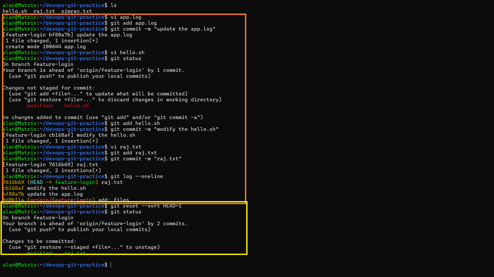
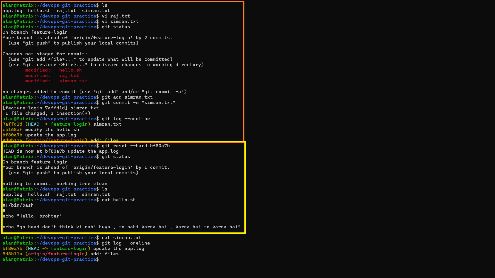
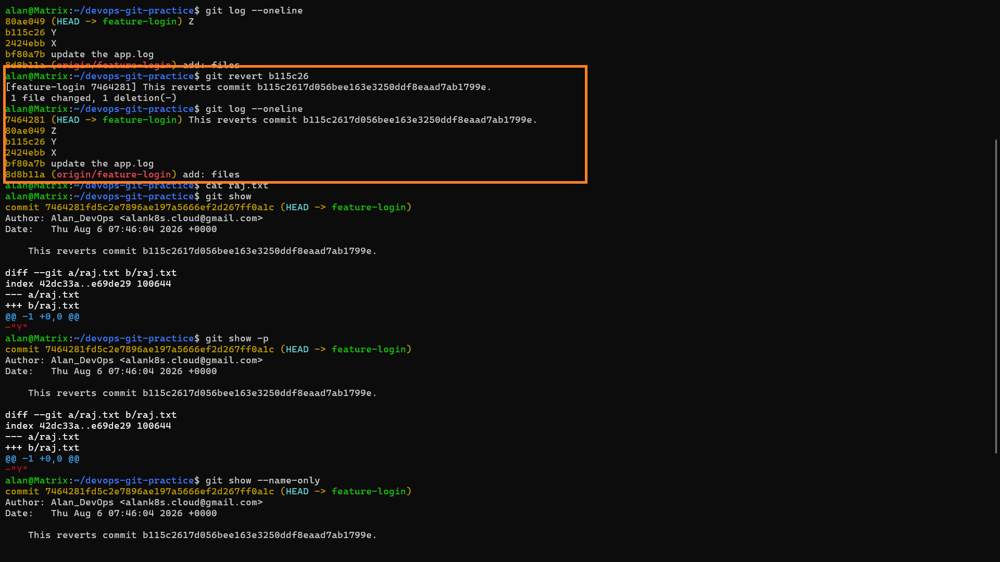

# Day 25 – Git Reset vs Revert & Branching Strategies

Notes and hands-on results for undoing mistakes safely in Git, plus a look at
branching strategies used by real engineering teams.

---

## Task 1: Git Reset — Hands-On

**What:** Make three commits, then practice undoing the last one using the
three reset modes — `--soft`, `--mixed`, `--hard`.

**Why:** Reset is one of the most misunderstood git commands because all
three flags "undo a commit," but they behave very differently with your
staged and working-directory changes. Doing it hands-on is the only way the
difference actually sticks — reading about it isn't enough to build the
muscle memory of "which flag do I want right now."

**Repo used:** `~/devops-git-practice`, branch `feature-login`.

### Commits A, B, C
```bash
$ vi app.log
$ git add app.log
$ git commit -m "update the app.log"
[feature-login bf80a7b] update the app.log
 1 file changed, 1 insertion(+)

$ vi hello.sh
$ git add hello.sh
$ git commit -m "modify the hello.sh"
[feature-login cb168af] modify the hello.sh
 1 file changed, 1 insertion(+)

$ vi raj.txt
$ git add raj.txt
$ git commit -m "raj.txt"
[feature-login 7616b69] raj.txt
 1 file changed, 2 insertions(+)

$ git log --oneline
7616b69 (HEAD -> feature-login) raj.txt       <- Commit C
cb168af modify the hello.sh                    <- Commit B
bf80a7b update the app.log                     <- Commit A
8d8b11a (origin/feature-login) add: files
```

### `git reset --soft HEAD~1`
```bash
$ git reset --soft HEAD~1
$ git status
On branch feature-login
Your branch is ahead of 'origin/feature-login' by 2 commits.

Changes to be committed:
	modified:   raj.txt
```
- HEAD moved back one commit, from Commit C (`7616b69`) to Commit B (`cb168af`).
- Commit C's file change (`raj.txt`) did **not** disappear — it landed right
  back in the **staging area**, shown under "Changes to be committed."
- Nothing in the working directory changed at all.

---
## Output:



---

### `git reset --mixed HEAD~1`
Re-committed `raj.txt` + a `hello.sh` edit together as commit `ffd7ef1`, then reset:
```bash
$ git commit -m "hello.sh"
[feature-login ffd7ef1] hello.sh
 2 files changed, 5 insertions(+)

$ git reset --mixed HEAD~1
Unstaged changes after reset:
M	hello.sh
M	raj.txt

$ git status
On branch feature-login
Your branch is ahead of 'origin/feature-login' by 2 commits.

Changes not staged for commit:
	modified:   hello.sh
	modified:   raj.txt
```
- HEAD moved back to `cb168af` again, same as before.
- This time the changes were **not** re-staged — `git reset --mixed`
  dumped them straight into the working directory as "Changes not staged
  for commit." I'd have to `git add` them again before committing.
---
## Output:


---
### `git reset --hard <commit>`
Added a new file `simran.txt`, committed it as `7affd1d`, then hard-reset all
the way back to Commit A (`bf80a7b`):
```bash
$ git add simran.txt
$ git commit -m "simran.txt"
[feature-login 7affd1d] simran.txt

$ git reset --hard bf80a7b
HEAD is now at bf80a7b update the app.log

$ git status
On branch feature-login
Your branch is ahead of 'origin/feature-login' by 1 commit.
nothing to commit, working tree clean

$ cat simran.txt
(empty output — the content is gone)

$ git log --oneline
bf80a7b (HEAD -> feature-login) update the app.log
8d8b11a (origin/feature-login) add: files
```
- HEAD jumped back to Commit A, and commits B and C's edits are completely
  gone — both from the index **and** the working directory.
- `git status` reports a perfectly clean tree, as if the later commits and
  the `simran.txt` edit had never happened. `cat simran.txt` confirms the
  content is wiped, not just unstaged.
- This is the only mode of the three that actually **destroys** uncommitted
  work sitting in your files.
---
## Output:



---

**Difference between `--soft`, `--mixed`, and `--hard`:**

| Mode | HEAD | Staging Area | Working Directory |
|---|---|---|---|
| `--soft` | Moved | Unchanged (keeps old commit's changes staged) | Unchanged |
| `--mixed` (default) | Moved | Reset to match new HEAD | Unchanged (changes appear as unstaged) |
| `--hard` | Moved | Reset to match new HEAD | Reset to match new HEAD (changes deleted) |

**Which one is destructive and why?**
`--hard` is destructive because it discards uncommitted work in the working
directory as well as the commit itself. `--soft` and `--mixed` only move
history and staging — your actual file changes are preserved on disk.

**When would you use each one?**
- `--soft`: You want to squash/redo a commit message or combine commits, but keep everything staged.
- `--mixed`: You want to "uncommit" but review/re-stage changes selectively before committing again.
- `--hard`: You are certain you want to throw away a commit and its changes completely (e.g., a broken experiment).

**Should you ever use `git reset` on commits that are already pushed?**
Generally **no**. Resetting rewrites history, so anyone who already pulled
those commits will have a diverging history and will hit conflicts or need a
force-push to reconcile. It's acceptable only on a private/feature branch
that no one else has pulled, and even then a force-push (`--force-with-lease`)
is required, which is risky on shared branches. `git revert` is the safer
choice for shared history.

---

## Task 2: Git Revert — Hands-On

**What:** Make three commits and then revert the middle one, then check
whether it disappears from history.

**Why:** Revert solves the same problem as reset (undo a bad commit) but
does it in a completely different, non-destructive way. The point of this
task is to see with your own eyes that the reverted commit *stays* in the
log — history only grows forward, it's never rewritten.

### Commits X, Y, Z
```bash
$ git log --oneline
80ae049 (HEAD -> feature-login) Z
b115c26 Y
2424ebb X
bf80a7b update the app.log
8d8b11a (origin/feature-login) add: files
```
(X, Y, Z each add a line to `raj.txt`.)

### Revert commit Y
```bash
$ git revert b115c26
[feature-login 7464281] This reverts commit b115c2617d056bee163e3250ddf8eaad7ab1799e.
 1 file changed, 1 deletion(-)
```
- Git created a **brand-new commit** (`7464281`) whose diff removes exactly
  the line that Y had added — no editor conflict this time since Y's line
  could be cleanly removed.
- `git show` on the new commit confirms it: `diff --git a/raj.txt b/raj.txt`
  with `-"Y"` as the only change.

### Check `git log`
```bash
$ git log --oneline
7464281 (HEAD -> feature-login) This reverts commit b115c2617d056bee163e3250ddf8eaad7ab1799e.
80ae049 Z
b115c26 Y                                          <- still here!
2424ebb X
bf80a7b update the app.log
8d8b11a (origin/feature-login) add: files
```
- Commit Y (`b115c26`) is **still visible** in the log, untouched.
- A new revert commit (`7464281`) sits on top of Z, cancelling Y's change
  while preserving the entire history — nothing was deleted or rewritten.

---
## Output:



---

**How is `git revert` different from `git reset`?**
`git reset` moves the branch pointer backward and can rewrite/erase history.
`git revert` moves history **forward** by adding a brand-new commit that
undoes the changes of a previous commit — the original commit stays intact
in the log.

**Why is revert considered safer than reset for shared branches?**
Because it never rewrites existing commits. Anyone who has already pulled
the branch can simply pull again and get the revert commit — no diverging
history, no force-push, no conflicts caused by history rewriting.

**When would you use revert vs reset?**
- Use **revert** on any branch that others have already pulled from (main,
  develop, release branches) — it's non-destructive and traceable.
- Use **reset** on local/private branches before pushing, when you want to
  clean up history (e.g., undo a bad local commit before anyone sees it).

---

## Task 3: Reset vs Revert — Summary

**What:** A side-by-side table comparing what each command does, whether
it deletes history, and whether it's safe on shared branches.

**Why:** Once you've felt the difference hands-on in Tasks 1–2, this forces
you to distill it into a decision rule you can recall instantly in real
work: "is this branch shared? Then revert. Is it private/local? Then reset
is fine."

| | `git reset` | `git revert` |
|---|---|---|
| **What it does** | Moves the branch/HEAD pointer to an earlier commit (optionally touching staging/working dir) | Creates a new commit that reverses the changes of a target commit |
| **Removes commit from history?** | Yes — commits after the reset point become unreachable (and can be garbage collected) | No — the original commit remains in history; a new "undo" commit is added |
| **Safe for shared/pushed branches?** | No — rewrites history, requires force-push, breaks collaborators' history | Yes — history stays linear and forward-moving, safe to push normally |
| **When to use** | Local/private branches, undoing recent uncommitted or unpushed work, cleaning up before push | Shared branches (main, develop, release), undoing a bug or bad change that's already public |

**One-line rule to remember:**
> If the commit has **not** been pushed → use `git reset`.
> If the commit has already been pushed and shared → use `git revert`.

---

## Task 4: Branching Strategies

**What:** Research and document GitFlow, GitHub Flow, and Trunk-Based
Development — how each works, a diagram, and pros/cons.

**Why:** Reset/revert is about undoing individual commits; this task zooms
out to how a whole team organizes commits across branches over time.
Different orgs pick different strategies based on release cadence and team
size, so understanding the trade-offs is what lets you reason about *why*
a company's workflow looks the way it does — not just follow it blindly.

### GitFlow
**How it works:** Uses long-lived `develop` and `main` branches, plus
supporting branches: `feature/*` (branched from `develop`), `release/*`
(branched from `develop` when preparing a release), and `hotfix/*` (branched
from `main` for urgent production fixes). Features merge into `develop`;
releases merge into both `main` and `develop`; hotfixes merge into both
`main` and `develop`.

**Flow diagram:**
```
main      ----------------o----------------o------->  (tagged releases)
                            \              /
release/1.0                  o----o----o
                            /              \
develop   --o--o--o--o--o--o----------------o--o--->
             \      \
feature/a     o--o--o
                     \
feature/b             o--o
```

**When/where used:** Projects with scheduled, versioned releases —
enterprise software, desktop apps, libraries with formal version numbers.

**Pros:** Clear structure, isolates in-progress work from production,
supports multiple release versions in parallel, good for release trains.

**Cons:** Heavyweight — many long-lived branches, merge overhead, slower
to get code into production, overkill for continuous deployment.

---

### GitHub Flow
**How it works:** A single long-lived `main` branch that is always
deployable. All work happens on short-lived `feature/*` branches created
from `main`. When a feature is ready, open a pull request, review, then
merge straight back into `main` and deploy.

**Flow diagram:**
```
main      --o--o-----------o--------o------->  (always deployable)
              \            /        /
feature/a      o--o--o--o-         /
                                   /
feature/b            o--o--o--o--o
```

**When/where used:** Web apps and SaaS products with continuous deployment
— GitHub itself, most modern startups.

**Pros:** Simple, fast, minimal branch overhead, plays well with CI/CD.

**Cons:** No built-in support for maintaining multiple release versions at
once; requires strong CI/testing discipline since `main` must always be
deployable.

---

### Trunk-Based Development
**How it works:** Everyone commits directly to `main` ("trunk") or uses
very short-lived branches (hours, not days) that merge back quickly. Large
or risky changes are hidden behind feature flags rather than long-lived
branches.

**Flow diagram:**
```
main   --o-o-o-o-o-o-o-o-o-o-o-o-o------->
              \  /   \ /
short-lived    o      o   (merged back within hours)
```

**When/where used:** High-velocity teams with strong CI/CD and automated
testing — Google, Meta, many large-scale continuous-deployment shops.

**Pros:** Minimizes merge conflicts and integration pain, encourages small
frequent commits, pairs naturally with feature flags and CI/CD.

**Cons:** Requires excellent automated testing and CI discipline; risky
without feature flags since incomplete work can reach `main` easily.


**Startup shipping fast:** **GitHub Flow.** It's lightweight, keeps `main`
deployable, and matches a small team shipping continuously without the
overhead of managing multiple release branches.

**Large team with scheduled releases:** **GitFlow.** The `develop` /
`release` / `hotfix` structure is built for coordinating many contributors
around versioned, scheduled releases.

**Favorite open-source project's strategy:** Checking the **Kubernetes**
repo on GitHub, it broadly follows a **trunk-based-style workflow**: most
contributions land on `main` via short-lived feature branches and pull
requests, with release branches cut only at release time rather than a
permanent `develop` branch. (Strategies vary by repo — check the
`CONTRIBUTING.md` of any project to confirm.)

---

## Task 5: Git Commands Reference (Days 22–25)

**What:** Consolidate everything learned across Days 22–25 (config, basic
workflow, branching, remotes, merge/rebase, stash/cherry-pick, reset/revert)
into one running reference file.

**Why:** This is your personal cheat sheet. The goal isn't to memorize
every flag — it's to have a single place you can grep through when you
forget a command mid-task, built up incrementally as you actually learn
each piece rather than copy-pasted from a tutorial.

This section was appended to `git-commands.md` in the `devops-git-practice` repo.

---

# Challenges Faced

* Understanding the difference between **reset and revert**.
* Practicing **soft, mixed, and hard reset**.
* Understanding **non-fast-forward errors** after resetting.
* Learning when history rewriting is dangerous.
* Understanding GitFlow, GitHub Flow, and Trunk-Based Development.
* Choosing the correct branching strategy for different teams.

---

# What I Learned

* `git reset` is useful for changing local history.
* `git revert` safely undoes changes using a new commit.
* `git reset --hard` can be destructive.
* Shared branches should generally use `git revert` instead of reset.
* GitFlow provides structured release management.
* GitHub Flow supports simple and fast CI/CD.
* Trunk-Based Development encourages frequent integration.

---
