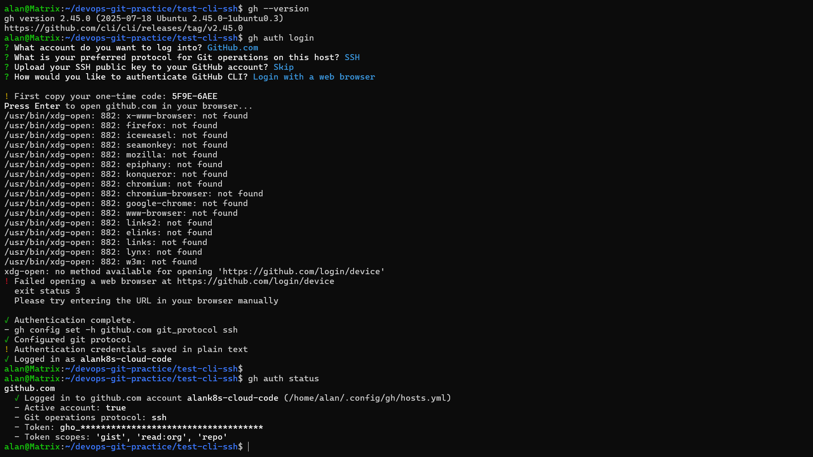
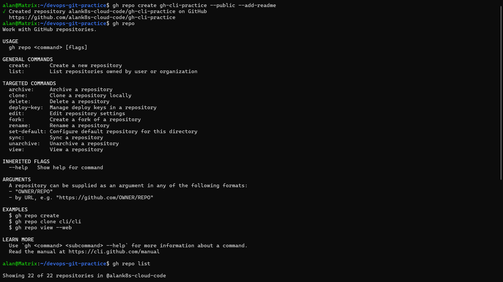
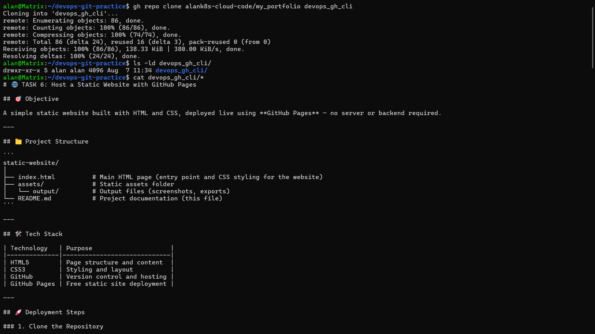
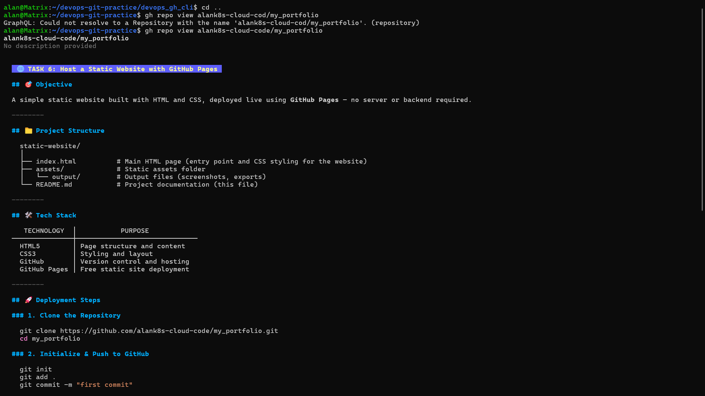
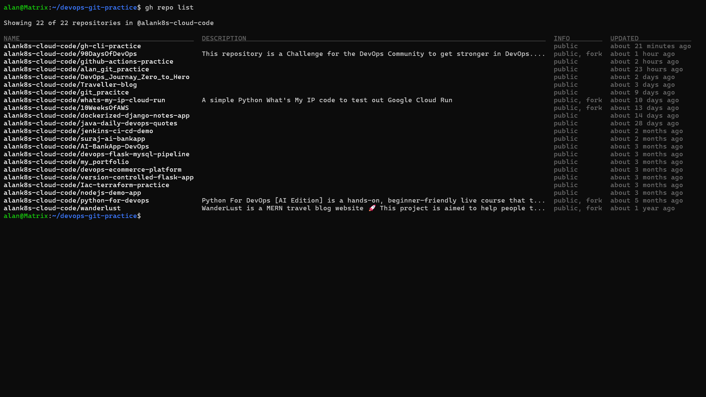
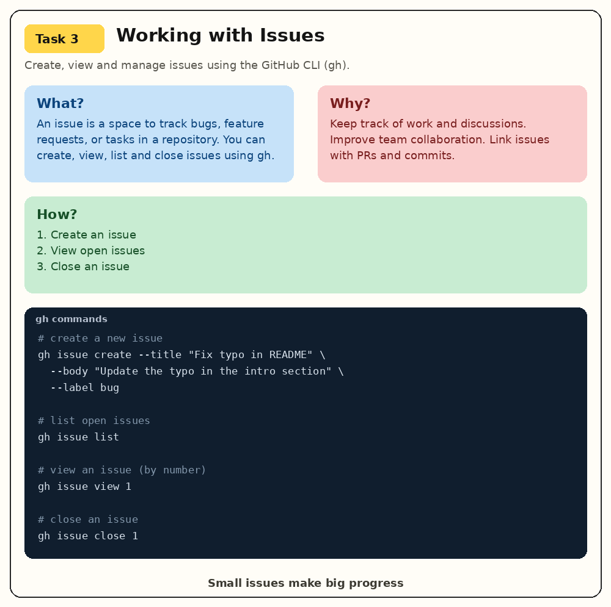
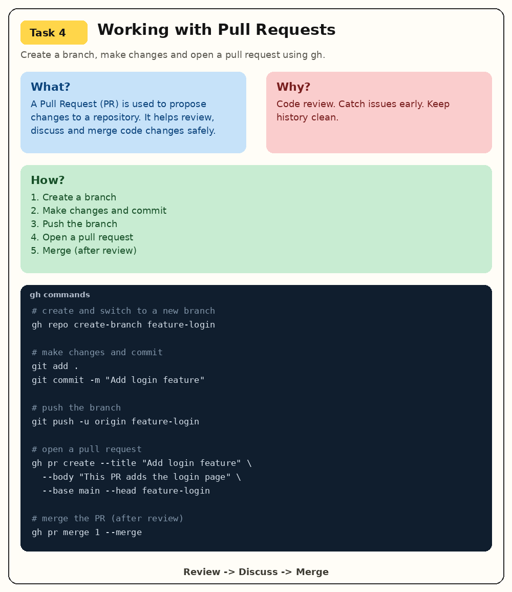
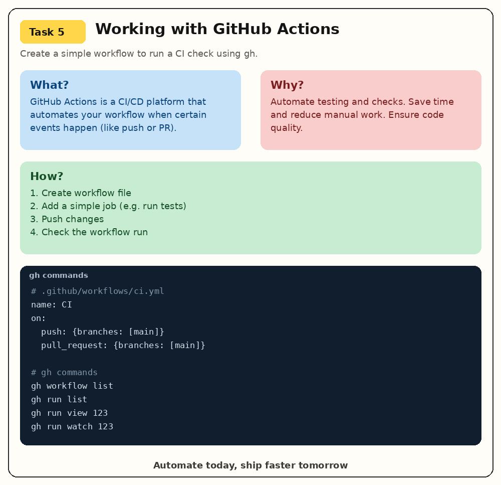

# Day 26 – GitHub CLI (`gh`): Manage GitHub from Your Terminal

## Objective

The goal of Day 26 was to learn how to use the **GitHub CLI (`gh`)** to manage GitHub directly from the terminal instead of switching between the terminal and browser.

This is useful for DevOps because GitHub CLI can be used with shell scripts, automation, CI/CD pipelines, and day-to-day repository management.

---

## What, Why, How?

### What is GitHub CLI?

GitHub CLI (`gh`) is GitHub's official command-line tool. It allows us to work with GitHub resources such as:

- Repositories
- Issues
- Pull Requests
- GitHub Actions workflows and runs
- Releases
- Gists
- GitHub API

The important difference is:

```text
Git       → Manage Git repositories and local source-code history
gh        → Manage GitHub resources from the terminal
```

### Why use GitHub CLI?

Using `gh` helps reduce context switching between the terminal and GitHub's web interface.

For a DevOps engineer, it is useful because GitHub operations can be included in:

- Bash scripts
- Automation
- CI/CD pipelines
- Repository management workflows
- Monitoring and alerting scripts

### How does it work?

```text
Terminal
   |
   v
GitHub CLI (gh)
   |
   +---- Repositories
   +---- Issues
   +---- Pull Requests
   +---- Actions
   +---- Releases
   +---- Gists
   +---- GitHub API
```

---

# Task 1: Install and Authenticate

## 1. Install GitHub CLI

On Ubuntu:

```bash
sudo apt update
sudo apt install gh
```

Verify the installation:

```bash
gh --version
```

---

## 2. Authenticate with GitHub

```bash
gh auth login
```

During authentication, GitHub CLI asks for the GitHub host and authentication method. A common flow is:

```text
GitHub.com
SSH
Login with a web browser
```

---

## 3. Verify Authentication

```bash
gh auth status
```

This shows the authenticated GitHub account, active account status, Git protocol, and available token scopes.

---

## 4. What authentication methods does `gh` support?

GitHub CLI supports authentication through GitHub.com or GitHub Enterprise hosts and can use browser-based authentication as well as token-based authentication.

For normal interactive setup, the easiest approach is:

```bash
gh auth login
```

Then verify with:

```bash
gh auth status
```

### Security note

Do not expose GitHub tokens in:

- GitHub repositories
- Screenshots
- Terminal recordings
- README files
- Shell history shared with others

The command below can display the token, so it should not be used while sharing your screen:

```bash
gh auth status -t
```

If an operation requires an additional scope, authentication can be refreshed. For example:

```bash
gh auth refresh -h github.com -s delete_repo
```
---
## Output



---

# Task 2: Working with Repositories

## 1. Create a repository from the terminal

Basic syntax:

```bash
gh repo create <repository-name>
```
---
## Output



Example:

```bash
gh repo create my_portfolio --public --clone --add-readme
```

### Important options

| Option | Purpose |
|---|---|
| `--public` | Create a public repository |
| `--private` | Create a private repository |
| `--clone` | Clone the repository after creation |
| `--add-readme` | Add a README.md |

---

## 2. Clone a repository using `gh`

```bash
gh repo clone OWNER/REPOSITORY
```

Example:

```bash
gh repo clone alank8s-cloud-code/my_portfolio
```

This performs the repository cloning operation directly through GitHub CLI.

Equivalent Git command:

```bash
git clone git@github.com:alank8s-cloud-code/my_portfolio.git
```

## Output



---

## 3. View repository details

```bash
gh repo view OWNER/REPOSITORY
```

Example:

```bash
gh repo view alank8s-cloud-code/my_portfolio
```

Machine-readable output can be requested with `--json`:

```bash
gh repo view alank8s-cloud-code/my_portfolio \
  --json name,description,isPrivate,defaultBranchRef
```

This is useful when repository information needs to be consumed by scripts.

---
## Output



---

## 4. List repositories

```bash
gh repo list
```

Limit the number of results:

```bash
gh repo list --limit 10
```
---
## Output



---

## 5. Open a repository in the browser

```bash
gh repo view OWNER/REPOSITORY --web
```

Example:

```bash
gh repo view alank8s-cloud-code/my_portfolio --web
```

If using WSL and the browser does not open automatically, the URL can be copied and opened from the Windows browser.

---

## 6. Delete a test repository

```bash
gh repo delete OWNER/REPOSITORY
```

Skip the confirmation prompt:

```bash
gh repo delete OWNER/REPOSITORY --yes
```

### Warning

Repository deletion is destructive. Always verify the repository name before running the delete command.

If you receive:

```text
HTTP 403:
Must have admin rights to Repository.
```

the authenticated token may not have the required `delete_repo` scope.

Refresh the permission:

```bash
gh auth refresh -h github.com -s delete_repo
```

---

# Task 3: GitHub Issues

## What is a GitHub Issue?

A GitHub Issue is used to track:

- Bugs
- Feature requests
- Tasks
- Improvements
- Operational problems

For DevOps, issues can also be created automatically when an operational event occurs.

Example:

```text
Backup job failed
       |
       v
Bash/Automation script
       |
       v
gh issue create
       |
       v
GitHub Issue
```

---

## 1. Create an issue

Syntax:

```bash
gh issue create --repo OWNER/REPO
```

Example:

```bash
gh issue create \
  --repo alank8s-cloud-code/my_portfolio \
  --title "Fix README formatting" \
  --body "The README contains formatting errors that need to be corrected." \
  --label "documentation"
```
---
## Output



---

## 2. List open issues

```bash
gh issue list --repo alank8s-cloud-code/my_portfolio
```

---

## 3. View a specific issue

```bash
gh issue view 1 \
  --repo alank8s-cloud-code/my_portfolio
```

Open it in the browser:

```bash
gh issue view 1 \
  --repo alank8s-cloud-code/my_portfolio \
  --web
```

---

## 4. Close an issue

```bash
gh issue close 1 \
  --repo alank8s-cloud-code/my_portfolio
```

Reopen an issue:

```bash
gh issue reopen 1 \
  --repo alank8s-cloud-code/my_portfolio
```

---

## 5. How can `gh issue` be used in automation?

A Bash script can create an issue when an operational task fails.

Example:

```bash
#!/bin/bash

gh issue create \
  --repo alank8s-cloud-code/my_portfolio \
  --title "Daily Backup Failed" \
  --body "The backup job failed during nightly execution." \
  --label "bug"
```

Possible DevOps use cases:

- Backup failures
- Server outages
- Disk-space alerts
- Security scan findings
- Deployment failures

This turns an operational failure into a trackable GitHub task.

---

# Task 4: Pull Requests

## What is a Pull Request?

A Pull Request (PR) is a request to merge changes from one branch into another.

Typical flow:

```text
main
  |
  +---- feature branch
           |
           +---- Make changes
           |
           +---- Commit
           |
           +---- Push
           |
           +---- Create PR
           |
           +---- Review
           |
           +---- Merge
```

---

## 1. Create a branch

```bash
git checkout -b feature/update-readme
```

Make a change:

```bash
nano README.md
```

Commit it:

```bash
git add .
git commit -m "Update README"
```

Push the branch:

```bash
git push origin feature/update-readme
```

---

## 2. Create a Pull Request using `gh`

```bash
gh pr create \
  --base main \
  --head feature/update-readme
```
---
## Output



---

You can also use:

```bash
gh pr create --fill
```

`--fill` can use information from commits to populate the PR title and body.

---

## 3. List open Pull Requests

```bash
gh pr list --repo OWNER/REPO
```

---

## 4. View Pull Request details

```bash
gh pr view <PR_NUMBER> --repo OWNER/REPO
```

Useful information includes:

- PR status
- Reviewers
- Checks
- Changed files
- Conversation

---

## 5. Review another person's PR

Checkout the PR locally:

```bash
gh pr checkout <PR_NUMBER>
```

View the changes:

```bash
gh pr diff <PR_NUMBER>
```

Review it:

```bash
gh pr review <PR_NUMBER> --approve
```

The important idea is that a reviewer can inspect and review a PR without leaving the terminal.

---

## 6. Merge a Pull Request

```bash
gh pr merge <PR_NUMBER>
```

Common merge strategies include:

```text
Merge commit
Squash merge
Rebase merge
```

Example:

```bash
gh pr merge <PR_NUMBER> --squash
```

A clean workflow can also delete the feature branch after merging:

```bash
gh pr merge <PR_NUMBER> --squash --delete-branch
```

---

## What merge methods does `gh pr merge` support?

The main merge methods are:

| Method | Purpose |
|---|---|
| Merge commit | Keeps the branch history and creates a merge commit |
| Squash | Combines PR commits into one commit |
| Rebase | Replays commits on top of the base branch |

The available method can also depend on the repository's branch protection and merge settings.

---

# Task 5: GitHub Actions & Workflows

This task is a preview of GitHub Actions.

## `gh workflow` vs `gh run`

The difference is important:

```text
Workflow
   |
   | YAML definition
   v
gh workflow
   |
   +---- list
   +---- view
   +---- run
           |
           v
        Workflow Run
           |
           v
        gh run
           |
           +---- list
           +---- view
           +---- logs
           +---- jobs
           +---- artifacts
```

### Workflow

A workflow is the YAML definition stored in the repository.

Useful commands:

```bash
gh workflow list
```

```bash
gh workflow view "Workflow Name"
```

View the YAML:

```bash
gh workflow view "Workflow Name" --yaml
```

Run a workflow manually:

```bash
gh workflow run "Workflow Name"
```

If the workflow has inputs:

```bash
gh workflow run "Workflow Name" \
  -f environment=testing
```
---
## Output



---

## Workflow Runs

List workflow runs:

```bash
gh run list
```

List runs for a particular workflow:

```bash
gh run list --workflow=matrix.yml
```

View a run:

```bash
gh run view <RUN_ID>
```

View jobs:

```bash
gh run view <RUN_ID> --json jobs
```

Watch a run:

```bash
gh run watch <RUN_ID>
```

View logs:

```bash
gh run view <RUN_ID> --log
```

View only failed logs:

```bash
gh run view <RUN_ID> --log-failed
```

Download artifacts:

```bash
gh run download <RUN_ID>
```

Open the run in the browser:

```bash
gh run view <RUN_ID> --web
```

---

## How could `gh run` and `gh workflow` help in CI/CD?

They can be used to automate and monitor CI/CD from scripts.

For example:

```text
Deployment script
      |
      v
gh workflow run
      |
      v
GitHub Actions
      |
      v
gh run list
      |
      v
Check deployment status
      |
      +---- Success → continue
      |
      +---- Failure → inspect logs
```

This can reduce manual interaction with the GitHub web interface.

---

# Task 6: Useful `gh` Tricks

## 1. `gh api`

`gh api` allows raw GitHub API requests directly from the terminal.

Example:

```bash
gh api user
```

Pretty-print JSON with `jq`:

```bash
gh api user | jq
```

Example API use:

```bash
gh api repos/OWNER/REPO/releases/latest
```

This is useful when a normal `gh` subcommand does not expose the exact information needed.

---

## 2. `gh gist`

A GitHub Gist is useful for sharing small pieces of code, configuration, scripts, or notes without creating a full repository.

Create a gist:

```bash
gh gist create file
```

Create a public gist:

```bash
gh gist create file --public
```

Add a description:

```bash
gh gist create file --public -d "Description"
```

List gists:

```bash
gh gist list
```

View a gist:

```bash
gh gist view <GIST_ID>
```

Open it in the browser:

```bash
gh gist view <GIST_ID> --web
```

---

## 3. `gh release`

A GitHub Release represents a published version of a project.

Example version tags:

```text
v1.0.0
v1.1.0
v2.0.0
```

Typical release flow:

```text
Code Complete
     |
     v
Create Git Tag
     |
     v
Push Tag
     |
     v
Create GitHub Release
     |
     v
Users download/use release
```

Create a release:

```bash
gh release create <tag>
```

A release can also contain release notes and project artifacts.

---

## 4. `gh alias`

Aliases create shortcuts for commands that are used frequently.

Example:

```bash
gh alias set wf 'workflow'
```

Then:

```bash
gh wf
```

List aliases:

```bash
gh alias list
```

Delete an alias:

```bash
gh alias delete wf
```

Aliases are useful when a command is used repeatedly during daily work.

---

## 5. `gh search repos`

Search public GitHub repositories directly from the terminal.

Example:

```bash
gh search repos "terraform aws"
```

You can combine searches with filters such as language or keywords to find useful DevOps projects.

Example idea:

```bash
gh search repos "kubernetes" --language go
```
---
## Output


---

# Useful `gh` Command Cheat Sheet

| Task | Command |
|---|---|
| Check version | `gh --version` |
| Login | `gh auth login` |
| Check authentication | `gh auth status` |
| Create repository | `gh repo create myrepo` |
| Clone repository | `gh repo clone owner/repo` |
| List repositories | `gh repo list` |
| View repository | `gh repo view owner/repo` |
| Open repository | `gh repo view owner/repo --web` |
| Delete repository | `gh repo delete owner/repo` |
| Create issue | `gh issue create` |
| List issues | `gh issue list` |
| View issue | `gh issue view <number>` |
| Close issue | `gh issue close <number>` |
| Create PR | `gh pr create` |
| List PRs | `gh pr list` |
| View PR | `gh pr view <number>` |
| Checkout PR | `gh pr checkout <number>` |
| View PR diff | `gh pr diff <number>` |
| Review PR | `gh pr review <number>` |
| Merge PR | `gh pr merge <number>` |
| List workflows | `gh workflow list` |
| Run workflow | `gh workflow run <workflow>` |
| List workflow runs | `gh run list` |
| View run | `gh run view <run-id>` |
| View logs | `gh run view <run-id> --log` |
| Download artifacts | `gh run download <run-id>` |
| GitHub API | `gh api <endpoint>` |
| Create gist | `gh gist create <file>` |
| Create release | `gh release create <tag>` |
| Create alias | `gh alias set` |
| Search repositories | `gh search repos` |

---

# Troubleshooting

## `HTTP 401: Bad credentials`

Possible reason:

```text
The GitHub token is invalid or missing.
```

Try:

```bash
gh auth login
```

or:

```bash
gh auth refresh
```

---

## `HTTP 403` while deleting a repository

Possible reason:

```text
The token does not have the delete_repo scope.
```

Refresh authentication:

```bash
gh auth refresh -h github.com -s delete_repo
```

---

## Workflow not found

If you see:

```text
could not find any workflows named ...
```

First list the workflows:

```bash
gh workflow list
```

Then use the exact workflow name or YAML filename.

---

## Required workflow input missing

If you see:

```text
Required input 'environment' not provided
```

Check the workflow definition:

```bash
gh workflow view "Workflow Name" --yaml
```

Then provide the required input:

```bash
gh workflow run "Workflow Name" \
  -f environment=testing
```

---

# DevOps Use Cases

GitHub CLI becomes especially useful when GitHub operations need to be automated.

### Example 1: Deployment failure

```text
Deployment
    |
    v
Failure detected
    |
    v
Shell script
    |
    v
gh issue create
    |
    v
GitHub Issue
```

### Example 2: CI/CD monitoring

```text
CI/CD Pipeline
      |
      v
gh workflow run
      |
      v
GitHub Actions
      |
      v
gh run watch
      |
      v
Check result
```

### Example 3: Repository automation

```text
Automation Script
      |
      +---- gh repo create
      |
      +---- gh issue create
      |
      +---- gh pr create
      |
      +---- gh release create
```

---

# What I Learned

- GitHub CLI allows GitHub to be managed directly from the terminal.
- `gh auth login` is used to authenticate.
- `gh auth status` verifies the active account.
- `gh repo` manages repositories.
- `gh issue` manages GitHub Issues.
- `gh pr` manages Pull Requests.
- `gh workflow` manages workflow definitions.
- `gh run` manages workflow executions.
- `gh api` provides direct access to the GitHub API.
- `gh gist` manages small shareable code snippets.
- `gh release` manages published project versions.
- `gh alias` can reduce repetitive typing.
- `gh search repos` can search GitHub repositories from the terminal.
- `--json` output is useful when integrating `gh` with scripts and automation.
- GitHub CLI is valuable for DevOps because many GitHub operations can be automated.

---

# Interview Questions

### 1. What is GitHub CLI?

GitHub CLI (`gh`) is GitHub's official command-line interface for managing GitHub resources from the terminal.

### 2. Why is GitHub CLI useful for DevOps?

It allows GitHub operations to be automated and integrated with shell scripts, CI/CD pipelines, and other automation tools.

### 3. What is the difference between Git and GitHub CLI?

```text
Git
→ Version control system
→ Commits
→ Branches
→ Local repository history

GitHub CLI
→ GitHub command-line interface
→ Issues
→ Pull Requests
→ Repositories
→ Actions
→ Releases
→ GitHub API
```

### 4. What is the difference between `gh workflow` and `gh run`?

`gh workflow` manages workflow definitions, while `gh run` manages executions of those workflows.

### 5. Why is `--json` useful?

`--json` produces machine-readable output, which is useful when GitHub CLI commands are used inside scripts and automation.

### 6. How can `gh issue` be used in DevOps automation?

A script can automatically create a GitHub Issue when a backup, deployment, monitoring check, or security scan fails.

### 7. What merge methods can be used with `gh pr merge`?

The main methods are merge commit, squash merge, and rebase merge, depending on repository settings.

---

# Day 26 Summary

```text
                    GitHub CLI
                        |
        +---------------+---------------+
        |               |               |
        v               v               v
     Repos           Issues             PRs
   gh repo         gh issue           gh pr
        |               |               |
        +---------------+---------------+
                        |
                        v
                 GitHub Actions
                        |
                 +------+------+
                 |             |
                 v             v
            gh workflow      gh run
                 |
                 v
              Automation
                 |
       +---------+---------+
       |         |         |
       v         v         v
     gh api   gh release  gh gist
                         |
                         v
                      gh alias
                         |
                         v
                   gh search repos
```

## Final Takeaway

The biggest lesson from Day 26 is that **GitHub does not have to be managed only through the browser**.

With `gh`, common GitHub operations can be performed from the terminal and combined with scripts and CI/CD automation. This makes GitHub CLI a useful tool for a DevOps engineer.

---

## References

- GitHub CLI: https://cli.github.com/
- GitHub CLI repository: https://github.com/cli/cli
- GitHub CLI reference: https://docs.github.com/en/github-cli/github-cli/github-cli-reference

---
