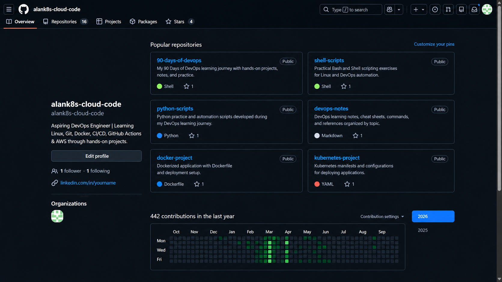
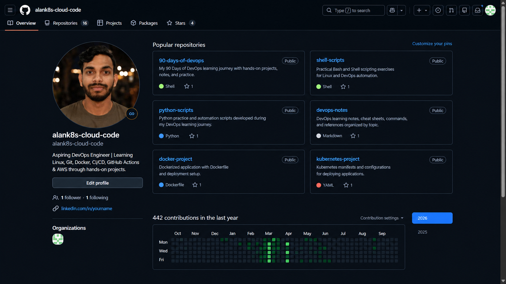

# Day 27 – GitHub Profile Makeover

## 🎯 Objective

Improve my GitHub profile so that it clearly represents my DevOps learning journey, projects, skills and practical work.

The goal was to make my GitHub profile easier for recruiters and other developers to understand.

---

# Task 1 – GitHub Profile Audit

Before making changes, I reviewed my GitHub profile from a recruiter's perspective.

### Questions

| Question                              | Result                                                      |
| ------------------------------------- | ----------------------------------------------------------- |
| Is my profile picture professional?   | Reviewed and improved                           |
| Is my bio filled in?                  | Updated with a DevOps-focused bio                           |
| Are my pinned repositories relevant?  | Updated to highlight important projects                     |
| Do my repositories have descriptions? | Added/updated descriptions                                  |
| Do my repositories have READMEs?      | Added or improved READMEs                                   |
| Can a recruiter understand my work?   | Improved through profile README and repository organization |

### New Bio

> Aspiring DevOps Engineer | AWS | Docker | Kubernetes | GitHub Actions | Linux

---

# Task 2 – Profile README

I created/updated my special GitHub profile repository:

```text
alank8s-cloud-code
```

The profile README contains:

- Short introduction
- Current learning goals
- \#90DaysOfDevOps progress
- DevOps skills and tools
- Important repositories
- LinkedIn contact
- GitHub link

The goal was to keep the README simple and focused instead of adding too many badges or widgets.

---

# Task 3 – Repository Organization

I organized my DevOps learning repositories.

## 90 Days of DevOps

Repository:

```text
90DaysOfDevOps
```

Purpose:

My day-by-day DevOps learning journey containing notes, assignments, practical exercises and projects.

Structure:

```text
2026/
├── day-01/
├── day-02/
├── ...
├── day-27/
└── day-90/
```

## Shell Scripts

Repository:

```text
shell-scripts
```

Purpose:

Contains Bash/Shell scripting exercises and automation work.

## Python Scripts

Repository:

```text
python-scripts
```

Purpose:

Contains Python practice and automation scripts used for DevOps learning.

## DevOps Notes

Repository:

```text
devops-notes
```

Purpose:

Contains organized notes, commands, cheat sheets and references for:

- Linux
- Git
- Shell
- Python
- Docker
- AWS
- Kubernetes
- GitHub Actions

---

# Task 4 – Pinned Repositories

I selected repositories that best represent my current DevOps journey.

My planned pinned repositories are:

1. `90DaysOfDevOps`
2. `github-actions-practice`
3. `github-actions-capstone`
4. `chatting-dockerize`
5. `10WeeksOfAWS`
6. `flask-app-practice`

These repositories demonstrate different parts of my learning:

```text
Learning
   ↓
DevOps
   ↓
GitHub Actions
   ↓
DevSecOps
   ↓
Docker
   ↓
AWS
   ↓
Application Projects
```

---

# Task 5 – Repository Cleanup

I reviewed my repositories for:

- Empty repositories
- Abandoned projects
- Unclear repository names
- Missing descriptions
- Missing README files
- Missing `.gitignore`
- Accidentally committed secrets

I removed/archived repositories that were no longer useful and improved the repositories that I wanted to keep.

---

# 🔐 Security Check

I checked my repositories for accidentally exposed secrets.

I specifically looked for:

- `.env` files
- AWS credentials
- API keys
- Passwords
- Docker Hub tokens
- Private keys
- GitHub tokens
- Database credentials

Secrets should be stored using appropriate secret-management mechanisms such as GitHub Actions Secrets rather than committed to Git.

---

# Task 6 – Before & After

## Before



---

## After




---

# 📈 Three Improvements

## 1. Created a clear profile README

### Why?

Previously, visitors had less context about my DevOps journey.

The new README immediately explains:

- Who I am
- What I am learning
- What tools I use
- What projects I have worked on
- Where to find my work

---

## 2. Improved repository organization

### Why?

Repositories should not look like random practice folders.

I organized my work into meaningful categories such as:

```text
90DaysOfDevOps
shell-scripts
python-scripts
devops-notes
github-actions-practice
```

This makes my GitHub easier to understand.

---

## 3. Highlighted practical DevOps projects

### Why?

A recruiter should be able to quickly find evidence of practical work.

I selected repositories demonstrating:

- DevOps learning
- GitHub Actions
- CI/CD
- DevSecOps
- Docker
- AWS
- Application projects

---

# 🧠 What I Learned

Today I learned that GitHub is more than a place to store code.

It can act as a developer portfolio.

A good profile should communicate:

```text
Who I am
    ↓
What I am learning
    ↓
What I have built
    ↓
How I solve problems
    ↓
How consistently I practice
```

I also learned that repository names, descriptions, README files, pinned repositories and security practices all contribute to a professional GitHub profile.

---

# 💼 Interview / Job Relevance

A recruiter or interviewer may use GitHub to understand:

- What technologies I practice
- Whether I build projects
- Whether I document my work
- How I organize repositories
- Whether I understand Git
- Whether I understand CI/CD
- Whether I follow basic security practices

Therefore, keeping GitHub organized is part of building my professional DevOps identity.

---

# ✅ Final Checklist

- [x] Profile audited
- [x] Profile README created/updated
- [x] Bio updated
- [x] Repository descriptions reviewed
- [x] READMEs created/updated
- [x] Repository names reviewed
- [x] `.gitignore` reviewed
- [x] Important repositories selected for pinning
- [x] Repository cleanup completed
- [x] Secret exposure checked
- [x] Before screenshot added
- [x] After screenshot added
- [x] Three improvements documente

---

## Final Result

My GitHub profile now presents a clearer picture of my journey toward becoming a DevOps Engineer.

The focus is on **learning in public, hands-on practice, automation, CI/CD, cloud and practical projects**.
